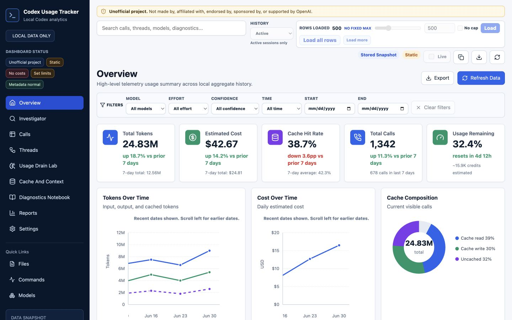
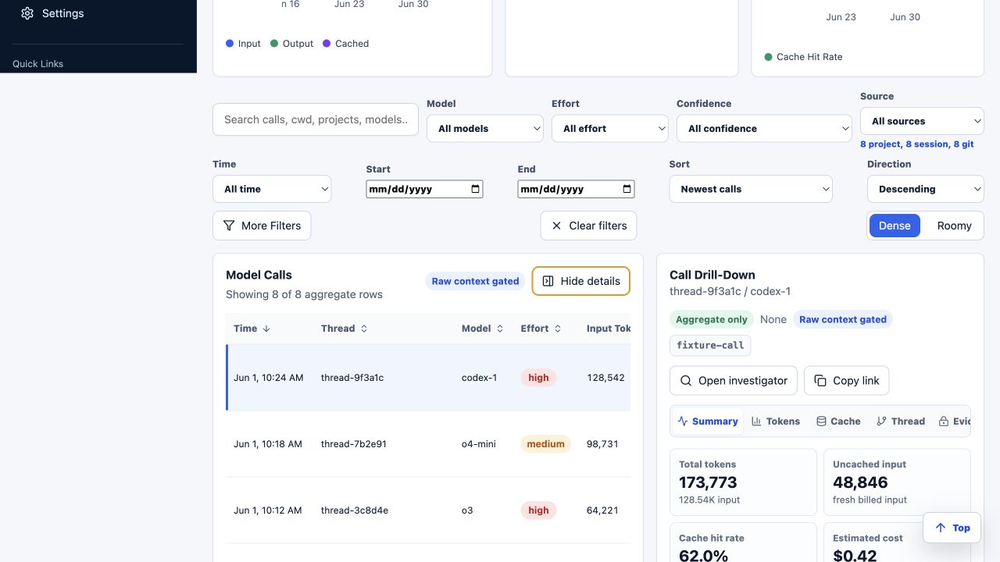
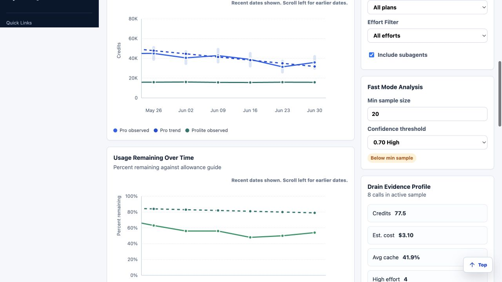
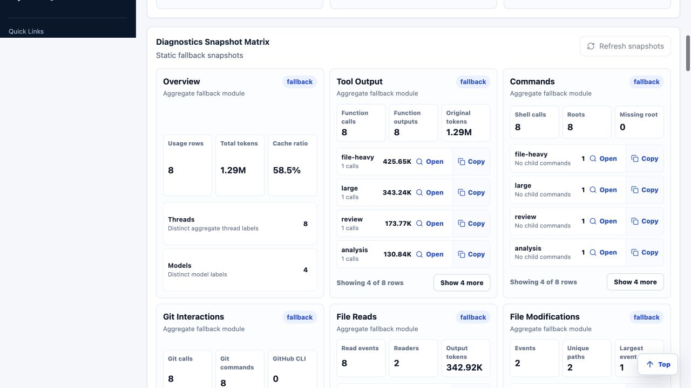
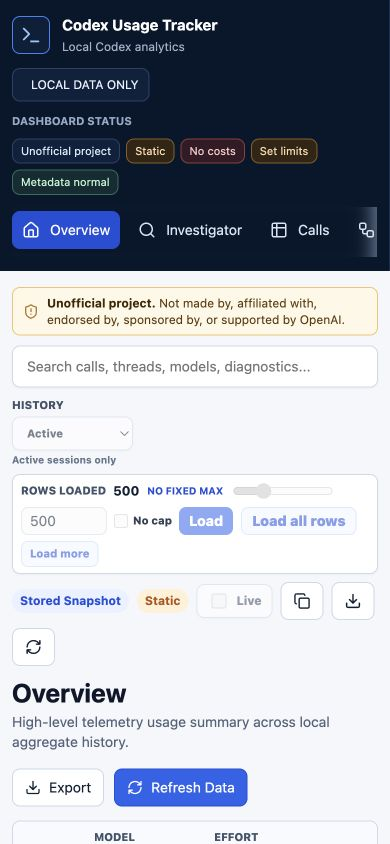
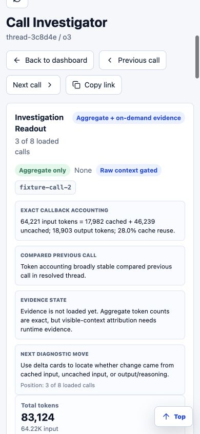
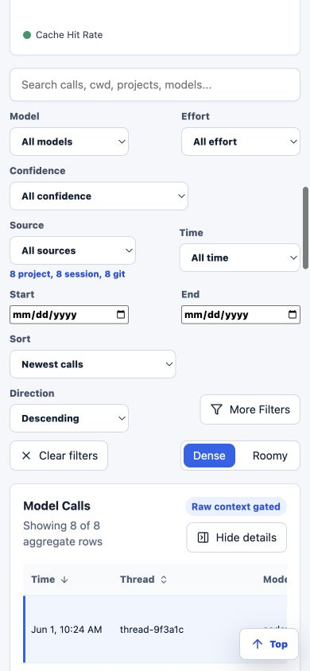

# Dashboard Final Redesign Audit

Status: decision input for `experiment/dashboard-final-redesign`

Audit date: 2026-07-10

Data used: synthetic dashboard fixtures only

## Purpose

This audit evaluates the current React dashboard before the last planned large
dashboard redesign prior to 1.0. It is intentionally broader than a visual
polish pass. It covers product hierarchy, workflow ergonomics, responsive
behavior, chart quality, data architecture, frontend ownership, accessibility
risk, performance, and the degree to which the rewritten API is actually used.

The current dashboard is not a failed product. It has substantial investigative
depth, useful drill-down behavior, and broad feature coverage. The problem is
that the shell and page composition obscure that value, while oversized modules
and shared global state make each additional improvement more expensive than it
should be.

## Method

- Inspected the React/Vite source, styles, tests, package graph, build output,
  server routes, and MCP documentation.
- Exercised Overview, Investigator, Calls, Call Investigator, Threads, Usage
  Drain, Cache and Context, Diagnostics, Reports, and Settings in the in-app
  browser.
- Captured desktop at 1440x900 and mobile at 390x844 using synthetic fixtures.
- Checked visible interaction paths, deep links, row activation, expanded
  detail states, notebook/report states, horizontal containment, console logs,
  and document-level overflow.
- Measured interactive target sizes and first-content placement. The mobile
  Calls heading begins 678 px down the document, and 82 of 92 visible
  interactive elements are under 44 px in at least one dimension. This is a
  risk signal, not a claim that every dense desktop control must be 44 px.
- Ran the production dashboard build. The current single JavaScript entry is
  about 598 kB minified and 172 kB gzip, with no route-level code splitting.
- Ran Agent Maintainer's new advisory frontend file baselines. They found 23
  dashboard-source findings and one dashboard-test finding.

No browser console or page errors were observed during the fixture walkthrough,
and no document-level horizontal overflow was observed at the measured desktop
or mobile viewport. Several intentional inner scroll regions remain difficult
to discover.

## Executive Assessment

The dashboard should be redesigned around an evidence workflow:

1. State what changed or deserves attention.
2. Show the strength, scope, and caveats of that conclusion.
3. Let the user traverse directly to the calls, threads, files, commands, or
   allowance observations that support it.
4. Preserve the current URL, filter, export, and raw-context safety guarantees.

Today the product often leads with controls, generic KPI cards, or report
libraries before it leads with the answer. The redesign should not merely make
those surfaces prettier. It should make every page answer a distinct user
question and reuse one evidence model across charts, tables, reports, and MCP.

## What Already Works

- Calls, threads, diagnostic facts, reports, allowance signals, and selected-call
  context are all reachable from one local application.
- Table rows and evidence rows can open Call Investigator, and direct URLs retain
  useful view state.
- Loaded-row scope, active/all-history scope, pricing confidence, static/live
  state, and privacy-sensitive context access are visible concepts.
- The server exposes much richer aggregate APIs than the original embedded
  dashboard payload.
- The fixture and React test suite is broad: 41 Vitest files and 242 tests passed
  during the Agent Maintainer upgrade.
- The visual vocabulary is restrained and appropriate for an analytical tool.
  A redesign can evolve it instead of replacing it with a novelty theme.

## Cross-Cutting Findings

### 1. The shell overwhelms the work

Desktop routes spend roughly the first 190 px on the disclaimer and top controls.
On mobile, the disclaimer, horizontally scrolling navigation, search, history,
row loading, live state, and icon actions consume roughly 680 px before the page
heading. This makes every route feel like the same control panel with different
content appended below it.

The row-loading controls are important, but they should be a compact, persistent
data-scope control with a clear progress state, not a full-width form repeated
above every task.

### 2. Navigation reflects implementation history, not user intent

Nine primary destinations plus quick links expose the module inventory directly.
Several destinations overlap conceptually: Investigator, Diagnostics, Usage
Drain, Cache and Context, and Reports all contain findings plus evidence. Mobile
navigation shows only a few items at once and has weak affordance that more items
exist.

The target information architecture should group routes under Overview, Explore,
Investigate, Limits, and Reports, with Settings and lower-frequency destinations
under More. Existing query-string URLs must continue to resolve.

### 3. Information is duplicated instead of composed

The same KPI cards and weekly-usage charts appear across Overview, Usage Drain,
Cache and Context, and Reports. Reports begins with a report catalog rather than
the selected report. Calls begins with charts before the table. Cache and Context
uses three oversized metric cards while the useful heatmap is below the fold.

Every metric or visualization should have one canonical semantic definition and
be embedded where it answers the current task. Repetition should be intentional
comparison, not page filler.

### 4. The best workflows are buried

The expanded Calls split view, selected thread evidence, diagnostic fact-to-call
drill-down, and full Call Investigator are the strongest parts of the product.
They appear after several screens of global and page-level setup. A redesign
should make evidence-linked selection the default interaction model across the
application.

### 5. Charts report values but do not yet support investigation

Current line, bar, and donut primitives are serviceable but generic. They lack a
shared grammar for confidence intervals, change points, annotations, linked
selection, brushing, comparison, table fallback, and export. The allowance API,
content index, waste diagnostics, cache signals, and thread timeline can now
support substantially better graphics.

### 6. Frontend ownership is too coarse

The largest current modules are:

| Module | Approximate lines | Primary concern |
| --- | ---: | --- |
| `features/calls/CallsPage.tsx` | 1,364 | Page, filtering, charts, table, details, and context state |
| `features/threads/ThreadsPage.tsx` | 1,016 | Aggregation, charts, selection, and evidence |
| `App.tsx` | 978 | Routing, shell, refresh, URL state, exports, and feature composition |
| `api/client.ts` | 886 | Fixtures, normalization, refresh jobs, polling, and transport |
| `features/call-investigator/CallInvestigatorPage.tsx` | 808 | Loading, navigation, readout, context, and presentation |
| `features/diagnostics/DiagnosticsPage.tsx` | 654 | Notebook orchestration and report rendering |

The dashboard contains about 28,220 TS, TSX, and CSS lines. CSS is split into 14
files, but ownership remains mostly global and design tokens are duplicated in
feature-oriented styles. `@tanstack/react-virtual` is installed but not used;
large tables currently reveal more rows by slicing rather than virtualizing.

### 7. The frontend underuses the API rewrite

The server provides focused calls, call detail, threads, thread calls, summary,
recommendations, allowance history, allowance diagnostics, allowance export,
reports, diagnostics, usage, and async refresh routes. The frontend still derives
many page models from `/api/usage` and a large boot model. In particular, summary,
recommendation, allowance, and thread-specific contracts are not yet first-class
frontend resources.

The dashboard should render shared API report contracts, not independently
recompute product conclusions in React.

## Workspace Review

| Workspace | Health | Keep | Redesign priority |
| --- | --- | --- | --- |
| Overview | Needs hierarchy | Recent calls, totals, trend context | Lead with prioritized changes and evidence; remove duplicate filler |
| Investigator | Strong concept, fragmented | Finding selection and evidence calls | Become the unified investigation workspace |
| Calls | Powerful but crowded | Dense table, filters, details, direct investigator links | Table-first layout, virtual rows, compact scope controls, stable detail drawer |
| Call Investigator | Strongest detailed view | Token/cache/context/thread evidence | Simplify nested cards; make decision summary and provenance persistent |
| Threads | Useful but squeezed | Cost-vs-turns and related calls | Lifecycle timeline, efficiency frontier, linked table/detail |
| Usage Drain | Valuable evidence, generic rendering | Weekly primary signal and caveats | Promote to Limits; add change points and evidence grading |
| Cache and Context | Valuable but below fold | Heatmap and cold-resume evidence | Integrate into Investigate with cache frontier and thread lifecycle |
| Diagnostics | Broad but dense | Persisted snapshots and fact drill-down | Evidence ledger, progressive disclosure, comparison rather than card matrix |
| Reports | Wrong first screen | Reproducible report payloads | Selected-report narrative first; catalog becomes a switcher |
| Settings | Functionally sound | Source health, privacy, allowance state | Group by Data, Estimates, Content access, and Application |

## Visual Evidence

### Desktop overview

The composition is orderly, but the persistent shell and repeated metric cards
occupy the most valuable space before the user reaches a decision or finding.

### Calls detail workflow

The table-to-detail workflow is worth preserving. The content density, clipped
columns, and detail-tab containment should be rebuilt around a stable master/detail
layout.

### Allowance evidence

This is important analysis with weak visual storytelling. Confidence, candidate
change points, resets, missing observations, and supporting calls should be
visible on the plot rather than explained elsewhere.

### Diagnostics notebook

The API breadth is visible, but repeated nested cards and labels reduce the
ability to compare findings or scan evidence quality.

### Mobile shell and workflows

The detailed call content adapts reasonably once reached. The dominant issue is
time-to-content: shell controls and page preambles force the primary task several
screens down, while horizontal table continuation is not obvious enough.

## Accessibility And Responsive Risks

- Mobile navigation and table overflow need explicit scroll affordances and
  equivalent non-horizontal alternatives for critical fields.
- Mobile inputs, checkboxes, icon actions, and row controls need larger effective
  hit areas even when their visual glyph remains compact.
- Muted labels, confidence text, status chips, and chart annotations need automated
  contrast checks against semantic tokens.
- Charts require keyboard navigation, screen-reader summaries, and a synchronized
  data table. SVG alone is not an accessible contract.
- Sticky headers, columns, command bars, and drawers must be tested at 200% zoom
  and with reduced motion.
- Route changes, async refresh progress, errors, and investigation selection need
  deliberate focus and live-region behavior.

## Decision

Proceed with a final large redesign on the experiment branch, keeping React,
Vite, TypeScript, TanStack Table, the existing API, direct route compatibility,
and synthetic fixture discipline. Do not preserve the current shell composition,
page-level duplication, manual route ownership, global CSS ownership, or large
page modules merely for visual continuity.

The redesign is complete only when it improves the product model and the code
model together. A prettier dashboard that leaves the same state ownership and
duplication in place is not an acceptable outcome.
