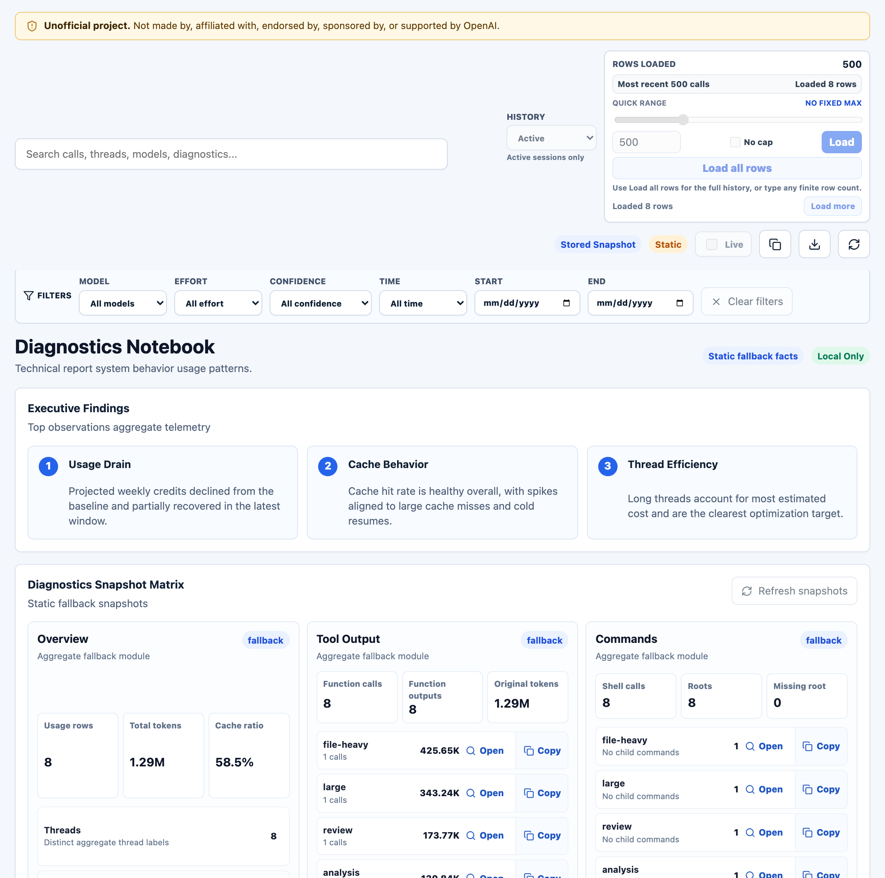
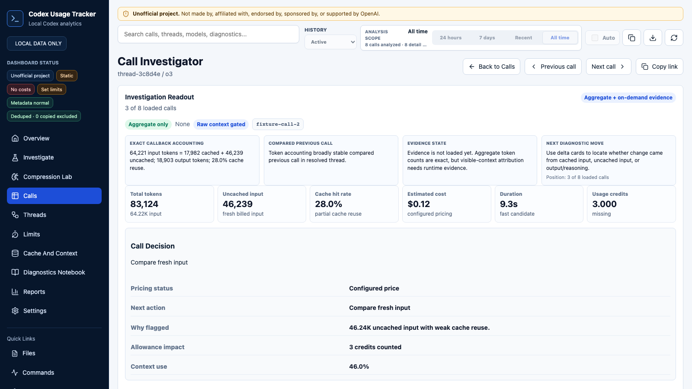

# Dashboard Guide

> **Unofficial project:** Codex Usage Tracker is independent and is not made by, affiliated with, endorsed by, sponsored by, or supported by OpenAI. OpenAI and Codex are trademarks of OpenAI.

This guide uses synthetic aggregate data. The screenshots do not contain real prompts, real assistant text, real tool output, or real Codex session content.

## Open The Dashboard

For the best experience, run the localhost dashboard server:

```bash
codex-usage-tracker setup
codex-usage-tracker update-pricing
codex-usage-tracker update-rate-card
codex-usage-tracker serve-dashboard --open
```

For optional allowance context, initialize a local template and copy values from Codex Usage or `/status`:

```bash
codex-usage-tracker init-allowance
codex-usage-tracker parse-allowance "5h 79% 6:50 PM Weekly 33% Jun 7"
```

To tune review thresholds locally, run `codex-usage-tracker init-thresholds` and edit `~/.codex-usage-tracker/thresholds.json`. This file is a JSON object keyed by recommendation threshold names such as `low_cache_ratio`, `high_context_percent`, and `high_cost_usd`; unknown keys are ignored. These thresholds control low-cache, high-context, high-uncached-input, large-thread, reasoning-spike, low-output, and high-cost recommendations.

To tune project attribution locally, run `codex-usage-tracker init-projects` and edit `~/.codex-usage-tracker/projects.json`. This file supports `aliases`, `ignored_paths`, and `tags`. The dashboard derives project name, relative cwd, branch, tags, and a hashed remote origin from aggregate `cwd` and local Git metadata when available.

Before sharing screenshots or generated artifacts, use `--privacy-mode redacted` or `--privacy-mode strict` before the subcommand:

```bash
codex-usage-tracker --privacy-mode strict serve-dashboard --open
codex-usage-tracker --privacy-mode strict dashboard --open
```

Redacted mode hides raw cwd/source paths, hides Git remote labels, and hashes unnamed projects while preserving configured aliases. Strict mode also hides project-relative cwd, Git branch, and tags. The dashboard header shows the active metadata mode.

`serve-dashboard` refreshes active-session logs before opening by default. Use `--no-refresh` only when you intentionally want a cached view of the existing local index.

Set the initial dashboard language with the global `--lang` option before the command, or use `CODEX_USAGE_TRACKER_LANG`:

```bash
codex-usage-tracker --lang vi serve-dashboard --open
CODEX_USAGE_TRACKER_LANG=vi codex-usage-tracker serve-dashboard --open
```

The dashboard language selector stores your browser preference locally. It localizes dashboard UI labels, captions, badges, empty states, detail-panel labels, context controls, and recommendation text; it does not translate raw data values, JSON fields, CSV columns, model names, thread names, project names, paths, or full CLI output.

The server keeps the HTML aggregate-only and enables two live features:

- `Refresh` rescans local Codex logs and updates the dashboard rows.
- The call investigator automatically reads the selected model call from the original local JSONL file when the localhost context API is enabled.

For a static snapshot, use:

```bash
codex-usage-tracker open-dashboard
```

Static file mode can still filter, sort, and inspect aggregate call fields. `open-dashboard` refreshes before writing the snapshot unless you pass `--no-refresh`. Static files cannot refresh from logs or load raw context after opening; use `serve-dashboard` when you want those live controls.

The localhost server uses a random per-server token for refresh and context API calls, validates loopback `Host` and `Origin` headers, and can start with context loading off through `codex-usage-tracker serve-dashboard --no-context-api`.

## Insights View


Open the `Insights` view when you want to answer "what needs attention?" before you start sorting tables.

- `Needs Attention` cards rank costly threads, Codex allowance usage, low cache reuse, context bloat, unpriced usage, estimated pricing, and reasoning-output spikes from aggregate fields only.
- `Investigation Presets` apply a view, derived filter, sort order, and explanatory caption together.
- Presets include highest-cost threads, highest Codex credits, context bloat, cache misses, pricing gaps, and estimated-price review.
- The top table shows threads by attention score so you can jump from a summary signal into a thread timeline or selected call.
- Clear an active preset to return to normal manual filtering and sorting.

## Calls View


Use `Calls` view when you want to inspect individual model calls.

- The header stays compact: refresh controls on the right, and short status chips on the left. Exact refresh time, pricing source, and credit-rate source live in hover titles so live refreshes do not reflow the page.
- The top cards include cached input, uncached input, Codex credit usage, and optional usage remaining instead of estimated-token, unpriced-token, and price-coverage counters.
- The `Confidence` filter separates exact cost, estimated cost, unpriced cost, exact credit-rate matches, inferred credit mappings, user credit overrides, and missing credit rates.
- The `Time` filter supports all time, today, this week, last 7 days, this month, and custom calendar ranges. Presets are relative to your browser's local date. Custom ranges use inclusive start and end dates.
- The `History` control defaults to `Active sessions only`. Switch to `All history` only when you want live refresh to scan archived session logs and include any archived rows already present in SQLite.
- The URL tracks the active view, filters, time preset or custom range, sort, preset, selected row or thread, page, and expanded threads. `Copy link` copies that state so the same investigation can be reopened.
- `Export CSV` downloads the currently filtered aggregate calls. In Threads view, it exports the calls behind the filtered thread list rather than only the visible group headers.
- A `Parser warnings` chip appears only when the latest refresh reports skipped token events, missing expected token fields, invalid counters, duplicate cumulative snapshots, or unknown event shapes. Use `codex-usage-tracker inspect-log <path>` to inspect a suspect log without writing to SQLite.
- Search matches thread, cwd, model, session id, turn id, subagent role, and parent thread fields.
- Search also matches derived project names, project-relative cwd values, tags, branch names, and redacted remote labels.
- In redacted or strict privacy mode, search only sees the redacted metadata fields included in the dashboard payload.
- The cards summarize only the currently visible filtered rows.
- Time values are shown in your browser's local date/time format while sorting and time filtering still use the logged timestamp.
- Calls include `Duration`, derived from turn start for a new turn or the previous same-turn call end for continuations, and `Prev gap`, the elapsed time since the previous call in the resolved thread.
- Calls view token columns separate total tokens, cached input, uncached input, and output so the accounting can be scanned without expanding a row.
- Source pucks are call-level estimates derived from local event metadata. `User` means the token-count segment included a user message, `Codex` means it followed tool output, compaction, or agent-continuation metadata, and `Unknown` means the source event metadata was unavailable or ambiguous.
- Click a column header like `Time`, `Thread`, `Tokens`, `Cost`, or `Cache` to sort. Use the sort menu for `Highest Codex credits`. Click the same header again to reverse the direction.
- Hover a row to scan a compact aggregate preview in `Call Details`; click a Calls row to open the dedicated call investigator.
- When expanded, the `Call Details` panel groups primary cost, Codex credit, allowance, cache, context, and pricing signals first, then thread narrative and token breakdowns.
- The first detail section includes a recommended action and a "why flagged" explanation derived only from aggregate counters and pricing/allowance metadata.
- Raw aggregate identifiers and source file metadata are collapsed until you need them.
- The expanded details panel reserves a visible scrollbar so long field lists are discoverable before you start scrolling.
- `Load more` appears when the active Insights, Calls, Threads, or expanded thread-call section has more rows to reveal.
- When served from localhost, `/api/usage` accepts `limit` and `offset` so automation can page aggregate rows without loading an entire large history.
- After you scroll down, the bottom-right `Top` button returns to the top of the dashboard.

Useful interpretation notes:

- `Last call total` is the token usage for the selected model call.
- `Session cumulative` is the running total Codex logged for that session at the time of that call.
- `Duration` is a best-effort elapsed time for the selected call segment. `Prev gap` can include waiting time between separate user turns because it measures from the previous resolved-thread call.
- `Cached input` and `Uncached input` are split so cache behavior is visible without storing transcript text.
- A cost with `*` means the pricing row is marked as a best-guess estimate.
- Codex credits are estimated from aggregate input, cached-input, and output token counters. Direct model matches use the bundled OpenAI Codex rate-card snapshot; inferred labels are marked estimated, and local credit-rate overrides are marked user-provided.
- `Usage observed` is not a live account query. It uses the latest local Codex `token_count.rate_limits` snapshot when present; otherwise configure `~/.codex-usage-tracker/allowance.json` with values copied from Codex Settings > Usage, the Codex Usage dashboard, or `/status` when you want current remaining allowance context.

## Threads View


Use `Threads` view when you want to understand a work session as a group instead of one call at a time.

- Each thread row groups the filtered model calls by thread name, falling back to session id when no name is available.
- Thread rows show latest activity, call count, model mix, effort mix, total tokens, estimated cost, Codex credits, cache ratio, and signal count.
- Mixed model summaries prefer the primary non-review model; `codex-auto-review` appears as the thread model only for review-only threads.
- Click a thread row to expand or collapse its calls. Multiple thread rows can stay open.
- Expanded calls default to newest first. Click an expanded-call header such as `Time`, `Tokens`, `Cost`, or `Cache` to sort that thread's visible calls without changing the top-level Threads ranking.
- Subagents with logged parent session ids are shown under the parent thread. Auto-review sessions without explicit parent ids may be attached by cwd and nearby activity and are marked as attached or inferred in the details.

## Diagnostics View



Use `Diagnostics` view when you want to see what structured event patterns are happening and what token totals are associated with those patterns.

- The tab consumes the localhost `/api/diagnostics/*` endpoints; static file dashboards show a live-API unavailable state.
- The first table shows top diagnostic facts by associated uncached input tokens. Tool/function/MCP/command-family and compaction sections expose narrower slices of the same fact data.
- Command diagnostics store only a command family such as `pytest`, `git`, or `unknown_command`. Skill and MCP labels are detected only when they are present as structured event metadata.
- Newer on-demand diagnostic snapshot endpoints are section-specific (`overview`, `tool-output`, `commands`, `git-interactions`, `file-reads`, `file-modifications`, `read-productivity`, `concentration`, and `usage-drain`). Heavy recomputation happens only through explicit diagnostic refresh endpoints. The dashboard's `Refresh diagnostics` button uses one batched refresh so source-log sections share one scan.
- Usage-drain snapshots run on indexed aggregate rows and render cumulative estimated-cost curves by thread, visible usage span counts, allowance-breakpoint highlights, and compact predictor summaries.
- Git interaction panels persist only safe roots and operations such as `git/status` or `gh/pr`, plus coarse categories and counts. They do not expose branch names, remotes, file paths, tags, commit messages, PR titles, release notes, or raw command output.
- File-modification panels count structured patch events and modified paths using basename-only labels plus short irreversible path hashes. They do not expose patch text, raw paths, file contents, or JSONL fragments.
- Click `Refresh diagnostics` when you want to recompute stored diagnostic snapshots. The normal dashboard `Refresh` action updates usage rows only.
- Snapshot panels show their stored status, last computed time, history scope, and logs scanned count. Missing or stale panels still render without forcing a source-log scan.
- `Tool Output` totals come from terminal wrapper metadata such as `Original token count`; missing-count rows show coverage gaps where that header was absent.
- File-read snapshots use basename-only path labels and short hashes. Read-productivity rates are temporal correlations between earlier reads and later structured patch events, not causation.
- Concentration snapshots show top-N share and effective group count by source log/session, cwd/project label, and day without exposing raw source-log or cwd paths.
- Click `Calls` on a fact row to load associated model calls. Call links and largest-call links open the Call Investigator, where raw context remains explicit and on demand.
- Associated token totals are not causal allocations and are not additive when one call has multiple diagnostic facts.

The same time range, model, reasoning, history scope, cards, and load controls apply in `Insights`, `Calls`, `Threads`, and `Diagnostics` views. Search, confidence, and sort controls currently scope the call/thread tables, not Diagnostics fact totals.

## Call Investigator



Clicking a Calls row opens `dashboard.html?view=call&record=<record_id>` for one model call. Hover remains the fast scanning surface; the investigator is the deeper diagnostic page for a single selected call. Expanded Threads rows and the details panel can still expose explicit investigator actions where a row click already has another meaning.

The investigator separates evidence by confidence:

- `Exact`: logged token callback counts, cost, Codex credits, cache ratio, model, effort, source, and context-window pressure.
- `Derived`: previous/next calls in the same resolved thread and cache/accounting deltas versus the previous chronological call.
- `Estimated`: visible new-context estimates, serialized local JSONL upper bounds, candidate serialized-overhead groups, and any remaining gap after that upper bound. These are attribution aids, not exact cached text spans.
- `Evidence`: redacted local JSONL turn-log evidence loaded at runtime for the selected investigator call.

Previous and next buttons move chronologically within the same resolved thread and keep the selected call in the URL. Cache diagnostics label common patterns such as warm cache reuse, cold resume or stale cache, partial cache miss, uncached spike, and post-compaction. Delta cards compare input, cached input, uncached input, output/reasoning output, and cache ratio to the previous call and use "cache/accounting delta" terminology because logs do not expose exact cached text spans.

## Details And Context


The details rail is collapsed by default to preserve table space. Open `Call Details` when you want a compact aggregate preview without leaving the table. When expanded on desktop, it sticks inside the viewport and scrolls internally when the selected call has more fields or loaded context than can fit on screen.

The call investigator loads a redacted turn-log evidence window by default when served from localhost with the context API enabled. The default request uses `mode=quick`: redacted tool output is included, no character cap is applied, and serialized local JSONL is reported as a fast character-based upper bound without bucket analysis. The default entry window is still bounded so very long sessions remain responsive. Older surrounding evidence is collapsed by default and can be expanded or loaded explicitly. Evidence entries include lightweight action timing derived from the timestamps already read during that same source-log scan, shown as elapsed time from the selected turn start, gap since the previous evidence entry, and reported event duration when the log provides one. Visible evidence token estimates are calculated from the full selected-turn evidence set before display limiting, using `tiktoken` when available and a conservative character fallback only when the tokenizer is unavailable.

Use `Run full serialized analysis` when you specifically want tokenizer-counted serialized JSONL groups such as encrypted reasoning/state, local goal metadata, token callback metadata, and rate-limit metadata. This full mode can explain why visible text is much smaller than exact uncached input, but it can overcount because local JSONL includes client metadata that may not be prompt text. Raw grouped text is not returned. `encrypted_content` is an opaque encrypted field found on some reasoning response items. The tracker cannot decrypt it and treats it as serialized state, not readable prompt, assistant, or tool text. Token-count context entries are labeled as the selected call, previous token count in the same turn, or earlier token count in the same turn when possible, and show call/session cumulative totals for input, cached input, uncached input, output, reasoning output, and total tokens.

For selected calls, the panel shows:

- primary cost, Codex credits, allowance impact, cache, uncached input, context use, pricing status, and next action
- thread attachment, source, parent-thread, and timestamp narrative
- input, cached input, uncached input, output, reasoning output, cumulative tokens, pricing fields, credit model, credit confidence, and rate-card source metadata
- collapsed raw aggregate identifiers
- collapsed source JSONL file and line metadata

For selected threads, the panel shows:

- estimated cost, Codex credits, allowance impact, attention score, cache ratio, max context use, pricing status, and next action
- lifecycle signals: first expensive turn, largest cumulative jump, cache trend, context trend, and whether subagent or auto-review work appeared before a usage spike
- a compact thread timeline with recent calls, cost, credits, cache, context, and pricing cues
- direct, subagent, auto-review, attached-call, and spawned-thread relationship counts

When served from localhost, the call investigator automatically fetches quick, redacted source evidence for only that call. The details panel still uses an explicit `Show turn log evidence` action so hovering rows does not pull raw context unexpectedly.

- `Hide tool output` reloads evidence without tool output when the output is noisy.
- `Show tool output` appears after hiding it and reloads evidence with redacted tool output included again.
- `Run full serialized analysis` reloads evidence with tokenizer-counted serialized JSONL group analysis.
- Compaction events are shown as metadata first. Replacement history is transcript-like content and is returned only after an explicit `Show compaction history` action, with redaction still applied.
- Raw context is not written to SQLite, CSV, or the generated dashboard HTML.
- If the server was started with `--no-context-api`, context loading starts off. Use `Enable context loading` in the details panel when you want to allow explicit row actions without restarting the dashboard server.

## Practical Workflow

1. Start with `serve-dashboard --open`.
2. Leave `Live` enabled while you work, or click `Refresh` after a Codex run finishes.
3. Leave `History` on `Active sessions only` for current work. Switch to `All history` when you intentionally want archived sessions included in the live refresh.
4. Optionally run `parse-allowance` with copied values from Codex Usage or `/status`, or initialize and edit `allowance.json` manually.
5. Start in `Insights` view and review the highest-severity attention cards.
6. Narrow the `Time` filter when you are investigating a recent spike or a specific work window.
7. Use a preset when the question is already clear: highest-cost threads, highest Codex credits, context bloat, cache misses, pricing gaps, or estimated-price review.
8. Use `Threads` view to find the active work thread and any spawned subagent calls.
9. Sort by `Cost`, `Highest Codex credits`, `Tokens`, `Cache`, or `Context` when you need manual comparison.
10. Use `Copy link` when you want to return to the same filter/sort/selection state later.
11. Use `Export CSV` when the current filtered aggregate calls need spreadsheet review.
12. Open the call investigator when aggregate fields are not enough; the investigator loads redacted evidence automatically when the context API is enabled.

## Investigating Long Chat Growth

Long-running Codex chats can carry a surprising amount of context into later turns. Prompt caching can reduce the cost of repeated input, but it does not make a large conversation free. Later calls may still include a large cached prefix, new uncached input, reasoning output, and tool-related context.

Use these dashboard fields together:

- `Cached input`: repeated context Codex was able to reuse.
- `Uncached input`: fresh context added by the current turn.
- `Session cumulative`: the running total Codex logged for the session.
- `Context use`: how much of the model's context window the call used.
- `Cache ratio`: whether the call is mostly reused context or mostly new input.

When a thread keeps growing but the old context is no longer helping, starting a fresh Codex thread may be more efficient than continuing to carry the same cached history forward.

## Privacy Model

The dashboard is designed to be shareable as an aggregate report, but only after you review it like any generated artifact.

It includes:

- session ids, thread names, cwd values, source file paths, timestamps, model labels, reasoning effort, token counts, cost estimates, Codex credit estimates, optional observed/copied allowance windows, and derived ratios

It does not include:

- prompts, assistant responses, raw tool output, pasted secrets, message snippets, or transcript text

The screenshots in this guide are produced from synthetic fixture data used by the test suite.

Use `--privacy-mode redacted` or `--privacy-mode strict` before sharing generated dashboards, CSV exports, query JSON, or support bundles. Redacted mode removes raw cwd/source paths and hides unnamed project names behind stable hashes. Strict mode also hides project-relative cwd, branch, and tags. Configured project aliases are treated as explicit display opt-ins in both modes.

Remaining 5-hour and weekly allowance is not inferred from the logged-in account plan. When Codex writes local `token_count.rate_limits` snapshots, the dashboard can show the latest observed local-log percentages; otherwise add `~/.codex-usage-tracker/allowance.json` when you want copied allowance state. Local Codex logs may also omit usage from other ChatGPT agentic surfaces that share the same allowance.

Archived sessions are excluded from dashboard payloads by default. The `All history` mode is an explicit opt-in because archived logs can make refreshes slower and can make current dashboards look inflated by older work.

Pricing and Codex credit estimates are source-stamped local calculations. Use `codex-usage-tracker pin-pricing --output <path>` when a report needs to keep the same USD pricing snapshot over time, and use `codex-usage-tracker update-rate-card` when you want an explicit local copy of the bundled Codex credit rate-card snapshot.
