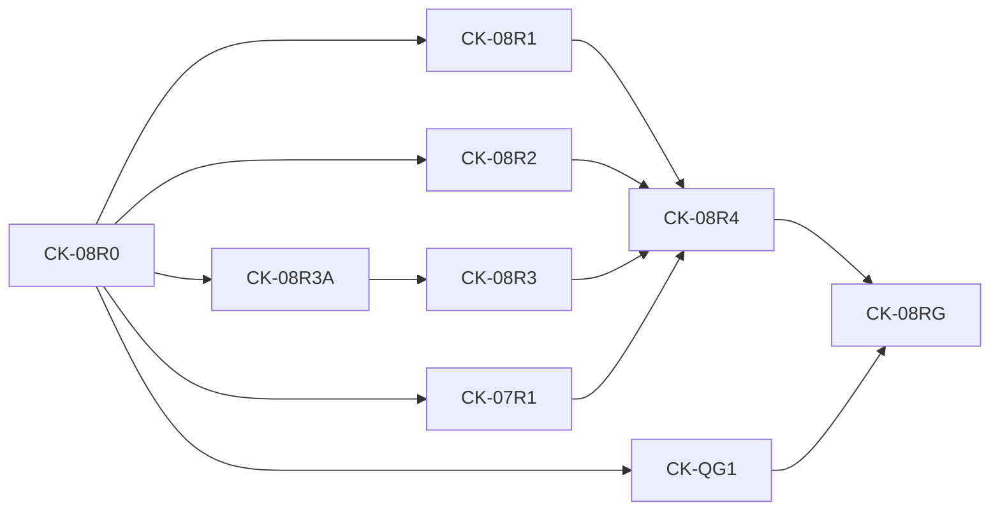

# Agent-First Clean-Cutover Roadmap

**Status:** Only authoritative implementation roadmap
**Program prefix:** `CK`
**Execution accounting:** `docs/roadmap/TASK_PACKETS.md`
**Remaining execution authority:** `docs/roadmap/REMAINING_EXECUTION_PLAN.md`
**Packet contracts:** `docs/roadmap/tasks/`

## Outcome

Build a clean local workflow-observability kernel that gives installed Codex
agents fast, exact, compact, evidence-grounded answers, then remove the 0.28
spike and Console before the new public release.

## Program rules

- Implement under `src/codex_usage_tracker/agent_kernel/`.
- Never import the spike root or open/migrate its database.
- Freeze a contract and failing oracle before production implementation.
- Connect every dependency edge with an executable seam contract naming the
  producer artifact, consumer path, independent truth source, and
  requalification set.
- A copied expected row, formula-consistent oracle, matching digest, or
  database-resident answer table does not prove canonical-fact lineage.
- If downstream work disproves an upstream semantic claim, stop the dependent,
  add a corrective packet, preserve the historical evidence, and requalify
  every affected seam before resuming.
- Use synthetic fixtures only.
- Query never refreshes.
- The host waits; the model never polls.
- Ordinary tails update bounded facts/lifecycle and current dirty projections.
- Qualitative conclusions remain model-owned.
- Parent CK-09 through CK-16 packets are umbrellas. Delegate only a Ready child
  task from `REMAINING_EXECUTION_PLAN.md`.
- A task may challenge and freeze a premise or implement a frozen premise,
  never both.
- Use one task branch/worktree and one focused PR per delegated child unless
  that child explicitly defines measured commit boundaries.
- Parallel lanes require explicit authorization, named owners/worktrees, one
  base, disjoint file allowlists, and a single integrator for shared contracts.
- Run one final read-only reviewer only after a meaningful diff is stable.
- Do not create Linear issues from this roadmap without explicit maintainer
  direction; `LINEAR_BACKLOG.md` is the import/source record.

## Phases

| Phase | Packets | Inputs | Outputs | Gate |
| --- | --- | --- | --- | --- |
| 0. Authority cleanup and spike freeze | CK-00 | 0.28 main and accepted direction | One docs index/roadmap, disposition, frozen oracle ref | No active contradictory docs or obsolete workflow artifacts |
| 1. Question and logical contracts | CK-01–CK-03 | Authority docs and catalog | Executable question registry, logical vectors, shared fixtures/oracles | Every supported question maps to facts, plans, evidence, budgets |
| 2. Physical decision | CK-04 | Shared contracts/harness | A/C/D results and architecture decision | One candidate passes hard gates and selection rule |
| 3. Canonical kernel | CK-05–CK-07, CK-07B/CK-07C/CK-07D contract corrections, CK-07E fact adapters, CK-07A seam correction | Selected design and executable seam contracts | Storage, identity, Codex adapter, ingestion, publication/recovery, executable formula/provenance/operand authority, effective-dated valuation, independent fact adapters, fact-lineage requalification | Exact facts and bounded tails survive lifecycle/crash matrix; pricing boundaries and published facts independently reconcile to question truth |
| 4. Answers and evidence | CK-08, CK-07R1/CK-08R*/CK-QG1, CK-09 | Published canonical kernel | Independent truth, physical keyset reads, qualified evidence/publication scale, measured projections, named plans | Corrective resume gate and all question/performance gates pass |
| 5. Installed agent experience | CK-10–CK-12 | Queryable kernel | Setup, MCP/skill/CLI, exact installed harness, full qualification | Fresh CLI/Desktop tasks pass accuracy/call/token/latency gates |
| 6. Clean cutover and retirement | CK-13–CK-14 | Fully qualified candidate | Cutover decision, clean package, spike/Console deletion | Replacement selected; prior public release remains reinstall rollback |
| 7. Enhancement and release | CK-15–CK-16 | Clean MVP | Optional presentation/Data Analytics handoff, public docs, release | Exact public artifacts and clean install pass |

## Critical path

```text
CK-00 -> CK-01 -> CK-02 -> CK-03 -> CK-04 -> CK-05 -> CK-06
-> CK-07 -> CK-07B -> CK-07C -> CK-07D -> CK-07E -> CK-07A -> CK-08
-> CK-08R0 -> {CK-08R1, CK-08R2, CK-08R3A, CK-07R1, CK-QG1}
CK-08R3A -> CK-08R3
{CK-08R1, CK-08R2, CK-08R3, CK-07R1} -> CK-08R4
{CK-08R4, CK-QG1} -> CK-08RG -> CK-09 -> CK-10 -> CK-11 -> CK-12
-> CK-13 -> CK-14 -> CK-16
```



CK-15 is post-MVP enhancement and does not block CK-16 unless the maintainer
explicitly includes it in the release scope.

## Parallel opportunities

Parallel work is optional and never changes dependency order.

| Checkpoint | Eligible lanes | Shared-owner restriction |
| --- | --- | --- |
| After CK-02 | Fixture generator, oracle case authoring, benchmark measurement schema | CK-03 integrator owns manifest and expected-answer schema. |
| CK-04 | Candidate A, C, and D implementations in separate experiment directories | One integrator owns shared harness/fixture/query/evidence contracts and final scoring. |
| After CK-05 | Codex adapter parser cases; storage failure-injection harness | Identity/domain/schema interfaces have one owner. |
| CK-07C after CK-07B | Plan/direct-fact binding artifact and pure compiler; deterministic valuation relation; missing canonical-fact representation | One integrator owns the binding schema, pure interface, database amendment, and CK-07A resume contract. |
| CK-07D after CK-07C | Effective-time boundary evaluator; rate-card frontier/compiler; database/publication integration and affected seam requalification | One integrator owns revision selection semantics, schema/publication amendments, valuation compiler, and CK-07A resume evidence. |
| CK-07E after CK-07D | Structural-reference adapter; query-only database-v1 adapter; parity/provenance/lifecycle qualification | One integrator freezes adapter interfaces, structural declarations, exact evidence schema, and disjoint file ownership before implementation lanes begin. |
| CK-07A after CK-07E | Expected-row generation; CK-04 proof replacement; CK-05–CK-07 replay | One integrator consumes the qualified CK-07E adapters and owns expected-row and seam-evidence schemas before disjoint lanes begin. |
| After CK-07A | Fact-backed query compiler; evidence cursor service; installed harness skeleton | Public request/result schemas and registry have one owner. |
| Corrective Wave 2 | Independent truth; query paging; EvidenceService physical query then evidence scale; lifecycle scale; maintainability | CK-08R0 froze `corrective-gates-v1`; five parallel lanes have disjoint locks, CK-08R3 is serialized after CK-08R3A, and CK-08R4 alone integrates measurements. |
| CK-09 | Admitted disjoint projection families after CK-09-01 freezes the registry | Projection registry, DDL, publication call site, and query bindings each have one integrator. |
| CK-10 | Application implementation and skill draft after CK-10-01 | Public schemas and manifests remain integrator-owned. |
| CK-11 | Artifact/CLI trials and Desktop/lower-model trials | Harness schema and scorecard aggregation remain integrator-owned. |
| CK-12 | Correctness, performance, recovery, and installed-artifact lanes | Candidate artifacts, fixture digest, and evidence schemas are immutable. |
| CK-14 | Runtime deletion and frontend/Node removal | Package/CI integration waits for both lanes and has one owner. |
| CK-15/CK-16 | Presentation decision and release-scope decision; later docs may overlap selected presentation | Release metadata, workflow, version, and final wording have one owner. |

Parallel candidate work should reduce elapsed time, not duplicate architecture
reasoning. No agent edits another lane's files or the shared ledger.

## Phase gates

### Gate G0: authority coherent

- every active document is in `docs/INDEX.md`;
- only this roadmap is active;
- obsolete workflow artifacts and references are absent;
- archives are marked non-authoritative;
- spike commit and deletion conditions are recorded;
- repository instructions point to this authority set.

Rollback: revert the planning branch; no runtime behavior changed.

### Gate G1: executable contracts

- every catalog ID has machine registry, logical primitives, plan/evidence
  route, synthetic cases, and less-capable-model behavior;
- logical identity/time/missing/token/lifecycle/allowance/valuation vectors
  pass independently of physical storage;
- fixture manifests are deterministic.
- every question case emits canonical typed facts for its exact typed request;
- an independent reference evaluator derives expected rows without production
  SQL, an answer table, or copied grading output.

Rollback: contract changes only. Resolve ambiguity before physical candidates.

### Gate G2: physical decision

- all candidates implement all five vertical slices;
- identical fixtures and harness;
- hard correctness/recovery/performance gates applied;
- query correctness is derived from permitted candidate facts; an
  `oracle_case`, `question_cases`, or equivalent expected-answer table cannot
  satisfy the gate;
- early failures recorded without long waits;
- DBHub dev-only comparison complete;
- one signed decision artifact selects tables/indexes and rejects alternatives.

Rollback: delete experiment branches/directories; production root remains
empty.

### Gate G3: canonical publication

- selected schema and identity version implemented;
- 30-day setup and standard/all-time build gates pass;
- no-change/one-call/one-tool/2,000-call tails meet budgets;
- reads stay available during build;
- source lifecycle and crash matrix pass;
- no raw bodies and no spike imports.
- consumer-side replay proves that the exact published database-v1 facts
  reconcile to independent expected rows for every admitted upstream question
  case.

Rollback: candidate database path is independent; spike remains untouched.

### Gate G4: answer kernel

CK-08's shared evaluator, post-materialization keyset, mixed SQL timing and
unproved scale/maintainability leave its three/18 labels provisional. CK-08R0
`corrective-gates-v1` keeps CK-09 blocked through CK-08RG: R1 supplies
independent truth; completed R2 bounds `data_health` and
`latest_publication_delta` keyset work while 19 plans retain exact gaps; R3A
removes the unbounded EvidenceService shape without semantic/budget change; R3/07R1 prove
evidence/publication scale; QG1 enforces maintainability; R4 emits measured
admission v2; RG authorizes exact-main resumption. Foundation/Cutover plans,
projection consumers/dirty bounds, lifecycle-stable evidence cursors, sorting,
counts, labels, four token columns, cost/credits, allowance and SQL/MCP/byte
gates must all pass their exact oracles at both scales.

Rollback: remove failing projection/plan or fall back to a fact-backed plan only
if it meets the named contract.

### Gate G5: installed Codex MVP

Exact wheel/plugin/skill clean install, coherent fresh CLI/Desktop exposure,
recommended setup/reopen, 100% Foundation/Cutover oracle accuracy,
call/poll/refresh/latency/response/token budgets, and the less-capable lane must
pass without checkout/side channel. Rollback: disable it and use public 0.28.

### Gate G6: clean cutover

The side-by-side drill and tested prior-release rollback precede deletion; only
the replacement remains packaged/runnable, with spike/Console/old schemas,
tools, routes, tests, assets, Node dependencies and compatibility code absent,
and package/CI ratchets lower. Before merge restore the cutover base; after
release install the prior version and independent database—never bundle legacy.

### Gate G7: public release

The name transition retains searchable Codex Usage Tracker references; setup,
questions, grades, limits and Data Analytics handoff stay accurate; one
build-once artifact set passes hashes, clean/public install, fresh-task smoke
and release checks; evidence is recorded.

## Performance objectives

Hard budgets remain in bake-off/qualification: 30-day publication p95 `<=5 s`
(stretch `<=2 s`); 90-day `<=15 s`; one-year `<=45 s`; 1.3-million-call
all-time `<=120 s` (stretch `<=60 s`); no-change `<=100 ms`; one-call/tool
tails and named P1/P2 local MCP `<=500 ms`; normal Tier 1 one tracker call and
`<=16 KB`; fresh installed answer p95 `<=15 s`, split tracker/host-model.

These are gates, not estimates to be weakened after implementation.

## Cutover criteria

CK-13 requires every locked contract and Foundation/Cutover question; all
crash/lifecycle cases; honest monotonic history/expansion; public/spike data
separation; exact artifacts on both Codex hosts and the lower-capability lane;
package/DB/WAL/response/token ratchets; no unresolved accepted review finding;
and reinstall of the prior public release without touching the new database.

## Runtime-retirement gate

CK-14 deletion requires: (1) recorded A/C/D winner/decision; (2) every
Foundation/Cutover oracle at 100,000 and production scale; (3) exact
wheel/plugin/skill cold/tail/no-change/query/evidence/payload/installed-agent
budgets; (4) crash/recovery/late/replacement/recanonicalization/valuation/
cross-publication lifecycle; (5) side-by-side drill with untouched spike and
public-0.28 rollback without conversion; (6) fresh CLI/Desktop accuracy,
usefulness, calls, latency and tokens including the less-capable lane; (7)
exact locally built candidate artifacts byte-identified and passing clean
install without checkout; and (8) maintainer deletion approval with no
unresolved accepted finding.

Public-index download/install verification is a CK-16 post-publication check,
not a prerequisite for CK-14. CK-14 must leave the tree capable of producing
the same qualified clean artifact set before CK-16 performs the protected
build and release.

## Definition of done

Done means: only the new kernel is packaged; old runtime/Console are deleted;
the catalog meets correctness/evidence/performance/call/token budgets; setup/
reopen is immediate and tails incremental/lock-bounded; fresh installed Codex
tasks gate verified public artifacts; ledger/backlog blocking work is complete;
every truth edge has producer identity, consumer replay, independent truth and
current requalification; future seams add no runtime burden.

## Explicit future items

MVP excludes Claude Code/other adapters, Evidence Viewer/Live Watch, MCP Apps/
native widgets, Claude Artifacts, bring-your-own packs, cross-agent/team/hosted
comparisons, automated recommendations, live overlay/DOM, shareable reports
and historical rate cards.

Admission requires a new question/experience contract, measured consumer value,
and no regression to the Codex-first core.
