# Agent-First Clean-Cutover Roadmap

**Status:** Only authoritative implementation roadmap
**Program prefix:** `CK`
**Execution accounting:** `docs/roadmap/TASK_PACKETS.md`
**Packet contracts:** `docs/roadmap/tasks/`

## Outcome

Build a clean local workflow-observability kernel that gives installed Codex
agents fast, exact, compact, evidence-grounded answers, then remove the 0.28
spike and Console before the new public release.

## Program rules

- Implement under `src/codex_usage_tracker/agent_kernel/`.
- Never import the spike root or open/migrate its database.
- Freeze a contract and failing oracle before production implementation.
- Connect every dependency edge with an executable seam contract naming the
  producer artifact, consumer path, independent truth source, and
  requalification set.
- A copied expected row, formula-consistent oracle, matching digest, or
  database-resident answer table does not prove canonical-fact lineage.
- If downstream work disproves an upstream semantic claim, stop the dependent,
  add a corrective packet, preserve the historical evidence, and requalify
  every affected seam before resuming.
- Use synthetic fixtures only.
- Query never refreshes.
- The host waits; the model never polls.
- Ordinary tails update bounded facts/lifecycle and current dirty projections.
- Qualitative conclusions remain model-owned.
- One task branch and one focused PR per packet unless a packet explicitly
  defines measured commit boundaries.
- Parallel lanes require explicit authorization, named owners/worktrees, one
  base, disjoint file allowlists, and a single integrator for shared contracts.
- Run one final read-only reviewer only after a meaningful diff is stable.
- Do not create Linear issues from this roadmap without explicit maintainer
  direction; `LINEAR_BACKLOG.md` is the import/source record.

## Phases

| Phase | Packets | Inputs | Outputs | Gate |
| --- | --- | --- | --- | --- |
| 0. Authority cleanup and spike freeze | CK-00 | 0.28 main and accepted direction | One docs index/roadmap, disposition, frozen oracle ref | No active contradictory docs or obsolete workflow artifacts |
| 1. Question and logical contracts | CK-01–CK-03 | Authority docs and catalog | Executable question registry, logical vectors, shared fixtures/oracles | Every supported question maps to facts, plans, evidence, budgets |
| 2. Physical decision | CK-04 | Shared contracts/harness | A/C/D results and architecture decision | One candidate passes hard gates and selection rule |
| 3. Canonical kernel | CK-05–CK-07, CK-07B/CK-07C/CK-07D contract corrections, CK-07E fact adapters, CK-07A seam correction | Selected design and executable seam contracts | Storage, identity, Codex adapter, ingestion, publication/recovery, executable formula/provenance/operand authority, effective-dated valuation, independent fact adapters, fact-lineage requalification | Exact facts and bounded tails survive lifecycle/crash matrix; pricing boundaries and published facts independently reconcile to question truth |
| 4. Answers and evidence | CK-08–CK-09 | Published canonical kernel | Query/evidence grammar, projections, Foundation/Cutover named plans | Question oracles and performance gates pass |
| 5. Installed agent experience | CK-10–CK-12 | Queryable kernel | Setup, MCP/skill/CLI, exact installed harness, full qualification | Fresh CLI/Desktop tasks pass accuracy/call/token/latency gates |
| 6. Clean cutover and retirement | CK-13–CK-14 | Fully qualified candidate | Cutover decision, clean package, spike/Console deletion | Replacement selected; prior public release remains reinstall rollback |
| 7. Enhancement and release | CK-15–CK-16 | Clean MVP | Optional presentation/Data Analytics handoff, public docs, release | Exact public artifacts and clean install pass |

## Critical path

```text
CK-00 -> CK-01 -> CK-02 -> CK-03 -> CK-04 -> CK-05 -> CK-06
      -> CK-07 -> CK-07B -> CK-07C -> CK-07D -> CK-07E -> CK-07A -> CK-08 -> CK-09 -> CK-10 -> CK-11 -> CK-12
      -> CK-13 -> CK-14 -> CK-16
```

CK-15 is post-MVP enhancement and does not block CK-16 unless the maintainer
explicitly includes it in the release scope.

```mermaid
flowchart LR
    C0[CK-00 Authority cleanup] --> C1[CK-01 Question registry]
    C1 --> C2[CK-02 Logical vectors]
    C2 --> C3[CK-03 Fixtures and oracles]
    C3 --> A[CK-04A Candidate A]
    C3 --> C[CK-04C Candidate C]
    C3 --> D[CK-04D Candidate D]
    A --> DEC[CK-04 Decision]
    C --> DEC
    D --> DEC
    DEC --> K[CK-05 Selected kernel]
    K --> AD[CK-06 Codex adapter and ingest]
    AD --> P[CK-07 Publication and recovery]
    P --> CONTRACT[CK-07B Formula and provenance contract]
    CONTRACT --> OPERANDS[CK-07C Plan operands and missing facts]
    OPERANDS --> RATES[CK-07D Effective-dated valuation]
    RATES --> ADAPTERS[CK-07E Independent fact adapters]
    ADAPTERS --> SEAM[CK-07A Fact-lineage seam repair]
    SEAM --> Q[CK-08 Query and evidence]
    Q --> PR[CK-09 Projections and named plans]
    PR --> UX[CK-10 Setup, MCP, skill]
    UX --> IH[CK-11 Installed harness]
    IH --> QUAL[CK-12 Qualification]
    QUAL --> CUT[CK-13 Cutover]
    CUT --> DEL[CK-14 Delete spike]
    DEL --> REL[CK-16 Public docs and release]
    DEL --> ENH[CK-15 Optional presentation]
    ENH -. optional .-> REL
```



## Parallel opportunities

Parallel work is optional and never changes dependency order.

| Checkpoint | Eligible lanes | Shared-owner restriction |
| --- | --- | --- |
| After CK-02 | Fixture generator, oracle case authoring, benchmark measurement schema | CK-03 integrator owns manifest and expected-answer schema. |
| CK-04 | Candidate A, C, and D implementations in separate experiment directories | One integrator owns shared harness/fixture/query/evidence contracts and final scoring. |
| After CK-05 | Codex adapter parser cases; storage failure-injection harness | Identity/domain/schema interfaces have one owner. |
| CK-07C after CK-07B | Plan/direct-fact binding artifact and pure compiler; deterministic valuation relation; missing canonical-fact representation | One integrator owns the binding schema, pure interface, database amendment, and CK-07A resume contract. |
| CK-07D after CK-07C | Effective-time boundary evaluator; rate-card frontier/compiler; database/publication integration and affected seam requalification | One integrator owns revision selection semantics, schema/publication amendments, valuation compiler, and CK-07A resume evidence. |
| CK-07E after CK-07D | Structural-reference adapter; query-only database-v1 adapter; parity/provenance/lifecycle qualification | One integrator freezes adapter interfaces, structural declarations, exact evidence schema, and disjoint file ownership before implementation lanes begin. |
| CK-07A after CK-07E | Expected-row generation; CK-04 proof replacement; CK-05–CK-07 replay | One integrator consumes the qualified CK-07E adapters and owns expected-row and seam-evidence schemas before disjoint lanes begin. |
| After CK-07A | Fact-backed query compiler; evidence cursor service; installed harness skeleton | Public request/result schemas and registry have one owner. |
| CK-09 | Disjoint projection families after dirty-key registry is frozen | Projection registry and publication call site have one owner. |
| CK-12 | CLI and Desktop fresh-task runs; performance repetitions; crash matrix | Candidate artifacts, fixture digest, and scorecard schema are immutable. |
| CK-14 | Runtime deletion; frontend/Node removal; package/CI cleanup | Package manifest and release checker have one owner. |
| CK-16 | Public guide, examples, screenshots/native artifacts if any | README/brand/install wording has one owner. |

Parallel candidate work should reduce elapsed time, not duplicate architecture
reasoning. No agent edits another lane's files or the shared ledger.

## Phase gates

### Gate G0: authority coherent

- every active document is in `docs/INDEX.md`;
- only this roadmap is active;
- obsolete workflow artifacts and references are absent;
- archives are marked non-authoritative;
- spike commit and deletion conditions are recorded;
- repository instructions point to this authority set.

Rollback: revert the planning branch; no runtime behavior changed.

### Gate G1: executable contracts

- every catalog ID has machine registry, logical primitives, plan/evidence
  route, synthetic cases, and less-capable-model behavior;
- logical identity/time/missing/token/lifecycle/allowance/valuation vectors
  pass independently of physical storage;
- fixture manifests are deterministic.
- every question case emits canonical typed facts for its exact typed request;
- an independent reference evaluator derives expected rows without production
  SQL, an answer table, or copied grading output.

Rollback: contract changes only. Resolve ambiguity before physical candidates.

### Gate G2: physical decision

- all candidates implement all five vertical slices;
- identical fixtures and harness;
- hard correctness/recovery/performance gates applied;
- query correctness is derived from permitted candidate facts; an
  `oracle_case`, `question_cases`, or equivalent expected-answer table cannot
  satisfy the gate;
- early failures recorded without long waits;
- DBHub dev-only comparison complete;
- one signed decision artifact selects tables/indexes and rejects alternatives.

Rollback: delete experiment branches/directories; production root remains
empty.

### Gate G3: canonical publication

- selected schema and identity version implemented;
- 30-day setup and standard/all-time build gates pass;
- no-change/one-call/one-tool/2,000-call tails meet budgets;
- reads stay available during build;
- source lifecycle and crash matrix pass;
- no raw bodies and no spike imports.
- consumer-side replay proves that the exact published database-v1 facts
  reconcile to independent expected rows for every admitted upstream question
  case.

Rollback: candidate database path is independent; spike remains untouched.

### Gate G4: answer kernel

CK-08 completes the fact-backed half of this gate with three
fact-table-sufficient plans and 18 measured CK-09 projection admissions.
CK-09 is ready as the next packet and has not started.

- CK-07D effective-dated valuation and affected seam requalification evidence
  is complete;
- CK-07E independent fact-adapter parity, provenance, independence, and
  lifecycle evidence is complete;
- CK-07A fact-lineage and downstream seam requalification evidence is complete;
- Foundation and Cutover named plans pass exact oracles;
- admitted projections name consumers and bounded dirty updates;
- evidence selectors/cursors survive rebuild/replacement/late events;
- complete-result sorting, exact counts, labels, four token columns,
  cost/credits, and allowance coverage behave as contracted;
- SQL/MCP/byte gates pass at both scales.

Rollback: remove failing projection/plan or fall back to a fact-backed plan only
if it meets the named contract.

### Gate G5: installed Codex MVP

- exact wheel/plugin/skill bundle installed cleanly;
- fresh CLI and Desktop tool exposure coherent;
- recommended setup and warm reopen pass;
- every Foundation/Cutover prompt has 100% oracle accuracy;
- call/poll/refresh, latency, response, and model-token budgets pass;
- less-capable model passes;
- no source-checkout or side-channel fallback.

Rollback: keep the new runtime disabled and continue using public 0.28.

### Gate G6: clean cutover

- side-by-side candidate drill passes;
- rollback by reinstalling/selecting the prior public release is documented and
  tested before deletion;
- replacement becomes the only packaged/runtime path;
- spike, Console, old schemas/tools/routes/tests/assets/Node dependencies, and
  compatibility code are absent;
- package and CI ratchets decrease.

Rollback before merge: restore from the clean cutover base. Rollback after
release: install the previous public version and its independent database; no
legacy runtime is bundled.

### Gate G7: public release

- public-facing name transition retains searchable Codex Usage Tracker
  references;
- setup examples, supported questions, grades, limitations, and Data Analytics
  handoff are accurate;
- one build-once artifact set passes exact hashes, clean/public install, fresh
  task smoke, and release checks;
- release evidence is recorded.

## Performance objectives

Hard budgets live in the bake-off and qualification documents. Program targets:

- 30-day first useful publication p95 `<=5 s`, stretch `<=2 s`;
- 90-day `<=15 s`;
- one-year `<=45 s`;
- 1.3-million-call all-time `<=120 s`, stretch `<=60 s`;
- no-change `<=100 ms`;
- one-call and one-tool complete-history tails `<=500 ms`;
- named P1/P2 local MCP `<=500 ms`;
- normal Tier 1 answer one tracker call and `<=16 KB`;
- fresh installed answer p95 `<=15 s`, with tracker and host/model portions
  reported separately.

These are gates, not estimates to be weakened after implementation.

## Cutover criteria

The maintainer may approve CK-13 only when:

- every locked logical contract is implemented;
- every Foundation/Cutover question passes;
- all crash and source-lifecycle cases pass;
- selected history and expansion are honest and monotonic;
- public data is separate from the spike path;
- exact installed artifacts pass both Codex hosts and lower-capability lane;
- package/DB/WAL/response/model-token ratchets pass;
- one final reviewer has no unresolved accepted finding;
- the previous public release can be reinstalled without touching the new
  database.

## Runtime-retirement gate

CK-14 may delete the spike runtime only after all of these active conditions
are true:

1. The A/C/D bake-off has a recorded winner and complete decision artifact.
2. The replacement passes every Foundation and Cutover question oracle at
   100,000-call and production-shaped scale.
3. Cold setup, ordinary tail, no-change, query, evidence, payload, and
   installed-agent budgets pass on the exact wheel/plugin/skill candidate.
4. Crash, recovery, late-event, source-replacement, recanonicalization,
   valuation-only, and cross-publication lifecycle tests pass.
5. A side-by-side cutover drill proves the spike remains untouched and rollback
   can reinstall/select public 0.28 without database conversion.
6. Fresh Codex CLI and Desktop tasks meet accuracy, usefulness, call-count,
   latency, and token budgets, including the less-capable-model lane.
7. The exact locally built candidate artifacts are byte-identified and pass
   clean-install smoke without source-checkout fallback.
8. The maintainer approves the final deletion checkpoint and no accepted review
   finding remains unresolved.

Public-index download/install verification is a CK-16 post-publication check,
not a prerequisite for CK-14. CK-14 must leave the tree capable of producing
the same qualified clean artifact set before CK-16 performs the protected
build and release.

## Definition of done

The clean-cutover program is complete when:

- the new agent kernel is the only packaged implementation;
- the old runtime and Console are deleted;
- the product answers the supported catalog within correctness/evidence/
  performance/call/token budgets;
- setup and reopen feel immediate for recommended history;
- ordinary tails are incremental and lock-bounded;
- fresh installed Codex tasks are the release gate;
- public artifacts are verified and released;
- the roadmap ledger and Linear backlog mark all blocking packets complete;
- every dependency used as truth has producer identity, consumer replay,
  independent truth, and current requalification evidence;
- optional future seams add no current runtime burden.

## Explicit future items

Design seams exist, but MVP does not implement:

- Claude Code and other agent adapters;
- Evidence Viewer and Live Watch;
- MCP Apps/native Codex widgets;
- Claude Artifacts;
- bring-your-own question packs;
- cross-agent/team/hosted comparisons;
- automated recommendations;
- live overlay/DOM integration;
- shareable reports and historical rate cards.

Admission requires a new question/experience contract, measured consumer value,
and no regression to the Codex-first core.
