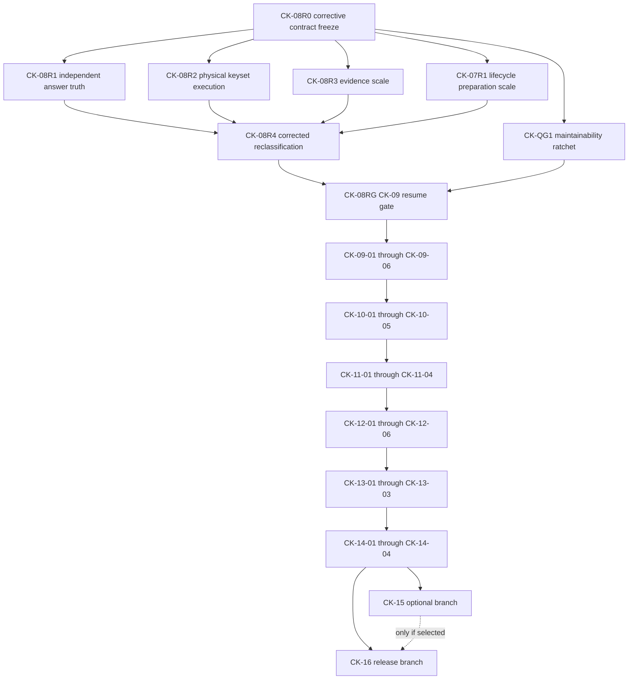

# Remaining Clean-Cutover Execution Plan

**Status:** Central execution authority for all remaining delegated work

This document is the source of truth for what remains after CK-08, which task
may start, who owns shared decisions, and which work may run in parallel. The
phase roadmap remains
[AGENT_FIRST_CLEAN_CUTOVER.md](AGENT_FIRST_CLEAN_CUTOVER.md); the completion
ledger remains [TASK_PACKETS.md](TASK_PACKETS.md). If their readiness wording
conflicts with this file, stop and reconcile all three before delegation.

## Current decision

CK-09 is blocked. The existing CK-08 result is valuable fact-backed mechanism
evidence, but four claims need corrective proof before projection admission:

1. the expected-answer lane imports production `evaluate_plan` and is not an
   independent semantic evaluator;
2. `QueryService` applies cursors after complete Python result materialization,
   so response pagination is bounded but physical deep-page work is not;
3. CK-08's `sql_p95_ms` includes compiler and Python evaluation work, and the
   provisional 18-plan projection list is not an admission decision;
4. evidence scale, publication lifecycle scale, and replacement-kernel
   maintainability need explicit qualification or enforcement.

Historical CK-04 through CK-08 completion evidence remains immutable. New
corrective evidence must link and supersede only the affected claims. Candidate
A, database-v1, canonical facts, publication identity, result envelopes,
selectors, cursor identity, and accepted product scope remain authoritative.

## Delegation law

- Delegate only a child task listed below whose status is **Ready**. Parent
  CK-09 through CK-16 packets are umbrellas and are never worker prompts.
- A task may freeze a premise or implement a frozen premise, never both.
- Sol-class architecture/integration owns premise challenges, contracts,
  schemas, registries, shared call sites, cutover decisions, and release gates.
  Writing owners use the configured write-capable `default` profile on
  `gpt-5.6-sol`; the `architect` profile is read-only advisory support.
- Luna-class workers may own one bounded implementation or immutable
  qualification lane after the controlling freeze is merged on exact `main`.
- Every task starts from the exact merged `origin/main` SHA containing all
  dependencies, uses its own branch/worktree, and normally produces one PR.
- Completion is self-propagating. After merge and exact-main verification, the
  completing task creates separate user-owned Codex tasks for every newly Ready
  successor in the machine-readable DAG. Independent successors fan out
  together; a join successor waits for every dependency.
- Successor creation is idempotent. Check existing roadmap tasks and the
  completion handoff before using `create_thread`; never create two active tasks
  for the same packet and exact dependency frontier.
- A blocked, unmerged, or unverified task creates no successor. It reports the
  blocker to its source/orchestrator task. Conditional and approval-gated edges
  remain subject to their packet prose.
- The primary integrator alone edits shared authorities, shared schemas and
  registries, publication integration call sites, package/release manifests,
  and final evidence aggregates.
- Parallel agents must have disjoint production and test ownership. They do not
  edit `AGENTS.md`, `docs/INDEX.md`, this file, the roadmap, ledger,
  qualification plan, parent packets, shared schemas/registries, or release
  manifests.
- Every producer task names its artifact identity, consumer seam, independent
  truth source, and exact executable comparison. Preparation does not claim
  implementation.
- A disproved premise stops its dependents. Preserve the reproduction, source
  or diff digest, and measurements; create a narrowly owned corrective task.
  Do not weaken a gate, silently delete the failed prototype, or ask the same
  worker to redesign the whole phase.
- Use synthetic fixtures only. Never inspect or persist real Codex bodies,
  secrets, private databases, or local tracker databases.
- Task names follow `<role> <short-scope>`.

## Shared-file integration locks

Only one integrator may own a lock at a time:

| Lock | Files or interfaces |
| --- | --- |
| Authority | `AGENTS.md`, `docs/INDEX.md`, roadmap, this plan, ledger, qualification plan, parent packets |
| Query physical | request/result contracts, query registry/compiler bindings, cursor version |
| Publication physical | analytical DDL, projection registry, writer/preparation integration ports |
| Installed surface | application envelope, MCP catalog, plugin manifest, `.mcp.json`, entry points |
| Qualification | candidate hashes, fixture identity, scorecard/evidence schemas, final aggregates |
| Cutover/release | package membership, CI, version fields, release workflow and artifact manifest |

## Dependency graph



## Task ledger and parallel waves

`Ready` is authorization to create a clean task. `Blocked` means do not create
or implement it.

| Wave | Task | Status | Recommended owner | Dependencies | Parallel rule |
| ---: | --- | --- | --- | --- | --- |
| 1 | [CK-08R0](tasks/ck-08r0-freeze-corrective-contracts.md) | **Ready** | default / Sol | exact current `main` | Serialized authority freeze |
| 2 | [CK-08R1](tasks/ck-08r1-build-independent-answer-truth.md) | Blocked | default / Sol | CK-08R0 | May parallel with R2, R3, 07R1, QG1 |
| 2 | [CK-08R2](tasks/ck-08r2-implement-physical-keyset-execution.md) | Blocked | default / Sol | CK-08R0 | Disjoint query lock |
| 2 | [CK-08R3](tasks/ck-08r3-qualify-evidence-scale.md) | Blocked | test engineer / Luna | CK-08R0 | Read-only qualification; failures create a new implementation child |
| 2 | [CK-07R1](tasks/ck-07r1-correct-lifecycle-preparation-scale.md) | Blocked | feature worker / Luna | CK-08R0 | Disjoint publication preparation |
| 2 | [CK-QG1](tasks/ck-qg1-enforce-agent-kernel-maintainability.md) | Blocked | refactorer / Sol | CK-08R0 | Checker/config only |
| 3 | [CK-08R4](tasks/ck-08r4-reclassify-physical-plans.md) | Blocked | default / Sol | R1, R2, R3, 07R1 | Serialized measurement integration |
| 4 | [CK-08RG](tasks/ck-08rg-authorize-ck09-resumption.md) | Blocked | default / Sol | R4, QG1 | Serialized exact-main gate |
| 5 | [CK-09-01](tasks/ck-09-01-freeze-residual-projection-registry.md) | Blocked | default / Sol | CK-08RG | Serialized projection freeze |
| 6 | [CK-09-02](tasks/ck-09-02-implement-usage-time-hierarchy-projections.md) | Blocked | feature worker / Luna | CK-09-01 | May parallel with 09-03/04 if admitted |
| 6 | [CK-09-03](tasks/ck-09-03-implement-workflow-tool-projections.md) | Blocked | feature worker / Luna | CK-09-01 | May parallel with 09-02/04 if admitted |
| 6 | [CK-09-04](tasks/ck-09-04-implement-allowance-evidence-projections.md) | Blocked | feature worker / Luna | CK-09-01 | May parallel with 09-02/03 if admitted |
| 7 | [CK-09-05](tasks/ck-09-05-bind-projection-backed-named-plans.md) | Blocked | default / Sol | accepted 09-02/03/04 lanes | Serialized query binding |
| 8 | [CK-09-06](tasks/ck-09-06-integrate-and-qualify-projections.md) | Blocked | default / Sol | CK-09-05 | Serialized integration/review |
| 9 | [CK-10-01](tasks/ck-10-01-freeze-application-interface-contracts.md) | Blocked | default / Sol | CK-09-06 | Serialized public-internal freeze |
| 10 | [CK-10-02](tasks/ck-10-02-implement-setup-refresh-status-services.md) | Blocked | feature worker / Luna | CK-10-01 | Application lock |
| 11 | [CK-10-03](tasks/ck-10-03-implement-cli-and-mcp-adapters.md) | Blocked | feature worker / Luna | CK-10-02 | Interface adapters only |
| 10 | [CK-10-04](tasks/ck-10-04-build-plugin-and-usage-skill.md) | Blocked | worker / Luna | CK-10-01 | May draft beside 10-02; no shared manifests |
| 12 | [CK-10-05](tasks/ck-10-05-integrate-installed-surface.md) | Blocked | default / Sol | CK-10-02/03/04 | Serialized manifest integration |
| 13 | [CK-11-01](tasks/ck-11-01-freeze-installed-harness-contract.md) | Blocked | default / Sol | CK-10-05 | Serialized harness freeze |
| 14 | [CK-11-02](tasks/ck-11-02-build-artifact-and-cli-trial-runner.md) | Blocked | test engineer / Luna | CK-11-01 | May parallel with 11-03 |
| 14 | [CK-11-03](tasks/ck-11-03-build-desktop-lower-model-trial-runner.md) | Blocked | test engineer / Luna | CK-11-01 | May parallel with 11-02 |
| 15 | [CK-11-04](tasks/ck-11-04-integrate-installed-agent-scorecard.md) | Blocked | default / Sol | CK-11-02/03 | Serialized scorecard integration |
| 16 | [CK-12-01](tasks/ck-12-01-freeze-qualification-candidate.md) | Blocked | default / Sol | CK-11-04 | Immutable candidate freeze |
| 17 | [CK-12-02](tasks/ck-12-02-run-correctness-query-evidence-qualification.md) | Blocked | test engineer / Luna | CK-12-01 | Parallel immutable lane |
| 17 | [CK-12-03](tasks/ck-12-03-run-performance-storage-payload-qualification.md) | Blocked | test engineer / Luna | CK-12-01 | Parallel immutable lane |
| 17 | [CK-12-04](tasks/ck-12-04-run-concurrency-crash-recovery-qualification.md) | Blocked | test engineer / Luna | CK-12-01 | Parallel immutable lane |
| 17 | [CK-12-05](tasks/ck-12-05-run-artifact-agent-qualification.md) | Blocked | test engineer / Luna | CK-12-01 | Parallel immutable lane |
| 18 | [CK-12-06](tasks/ck-12-06-integrate-hardening-decision.md) | Blocked | default / Sol | CK-12-02/03/04/05 | Serialized fixes, review, decision |
| 19 | [CK-13-01](tasks/ck-13-01-freeze-cutover-rollback-drill.md) | Blocked | default / Sol | CK-12-06 | Serialized preparation |
| 20 | [CK-13-02](tasks/ck-13-02-switch-public-entry-points.md) | Blocked | feature worker / Luna | CK-13-01 | Entry-point lock |
| 21 | [CK-13-03](tasks/ck-13-03-verify-cutover-approve-retirement.md) | Blocked | default / Sol | CK-13-02 | Serialized rollback/deletion gate |
| 22 | [CK-14-01](tasks/ck-14-01-freeze-retention-deletion-manifest.md) | Blocked | default / Sol | CK-13-03 | Serialized retirement inventory |
| 23 | [CK-14-02](tasks/ck-14-02-delete-spike-runtime.md) | Blocked | worker / Luna | CK-14-01 | May parallel with 14-03 |
| 23 | [CK-14-03](tasks/ck-14-03-delete-console-frontend-node.md) | Blocked | worker / Luna | CK-14-01 | May parallel with 14-02 |
| 24 | [CK-14-04](tasks/ck-14-04-integrate-package-ci-cleanup.md) | Blocked | default / Sol | CK-14-02/03 | Serialized package/CI integration |
| 25 | [CK-15-01](tasks/ck-15-01-decide-native-presentation-admission.md) | Blocked | default / Sol | CK-14-04 | Optional; may parallel with 16-01 |
| 26 | [CK-15-02](tasks/ck-15-02-implement-qualify-native-presentation.md) | Blocked | feature worker / Luna | CK-15-01 selected | Optional; serial within CK-15 |
| 25 | [CK-16-01](tasks/ck-16-01-freeze-release-scope-version.md) | Blocked | default / Sol | CK-14-04 | May parallel with CK-15-01 |
| 26 | [CK-16-02](tasks/ck-16-02-write-public-docs-synthetic-assets.md) | Blocked | worker / Luna | CK-16-01 | May overlap selected CK-15-02 |
| 27 | [CK-16-03](tasks/ck-16-03-build-once-qualify-release-candidate.md) | Blocked | default / Sol | CK-16-02 and selected CK-15-02 | Serialized build/release lock |
| 28 | [CK-16-04](tasks/ck-16-04-publish-verify-public-artifacts.md) | Blocked | default / Sol | CK-16-03 + maintainer approval | External, strictly serialized |

### Machine-readable delegation DAG

Tests bind this manifest to the table, ledger, file headings, statuses, known
dependencies, and acyclic order. Conditional policy gates such as optional
CK-15 selection and maintainer publication approval remain stricter prose
conditions in the table and child files; they are not unconditional DAG edges.

<!-- delegated-task-dag:start -->
```json
{
 "schema": "codex-usage-tracker.remaining-delegation-dag.v1",
 "orchestration": {
  "mode": "self-propagating",
  "spawn": "all_newly_ready_successors",
  "join": "all_dependencies_complete",
  "duplicate_policy": "one_active_task_per_packet_and_dependency_frontier",
  "blocked_policy": "spawn_none_and_report_to_orchestrator"
 },
 "ready": ["CK-08R0"],
  "tasks": [
    {"id": "CK-08R0", "file": "tasks/ck-08r0-freeze-corrective-contracts.md", "dependencies": []},
    {"id": "CK-08R1", "file": "tasks/ck-08r1-build-independent-answer-truth.md", "dependencies": ["CK-08R0"]},
    {"id": "CK-08R2", "file": "tasks/ck-08r2-implement-physical-keyset-execution.md", "dependencies": ["CK-08R0"]},
    {"id": "CK-08R3", "file": "tasks/ck-08r3-qualify-evidence-scale.md", "dependencies": ["CK-08R0"]},
    {"id": "CK-07R1", "file": "tasks/ck-07r1-correct-lifecycle-preparation-scale.md", "dependencies": ["CK-08R0"]},
    {"id": "CK-QG1", "file": "tasks/ck-qg1-enforce-agent-kernel-maintainability.md", "dependencies": ["CK-08R0"]},
    {"id": "CK-08R4", "file": "tasks/ck-08r4-reclassify-physical-plans.md", "dependencies": ["CK-08R1", "CK-08R2", "CK-08R3", "CK-07R1"]},
    {"id": "CK-08RG", "file": "tasks/ck-08rg-authorize-ck09-resumption.md", "dependencies": ["CK-08R4", "CK-QG1"]},
    {"id": "CK-09-01", "file": "tasks/ck-09-01-freeze-residual-projection-registry.md", "dependencies": ["CK-08RG"]},
    {"id": "CK-09-02", "file": "tasks/ck-09-02-implement-usage-time-hierarchy-projections.md", "dependencies": ["CK-09-01"]},
    {"id": "CK-09-03", "file": "tasks/ck-09-03-implement-workflow-tool-projections.md", "dependencies": ["CK-09-01"]},
    {"id": "CK-09-04", "file": "tasks/ck-09-04-implement-allowance-evidence-projections.md", "dependencies": ["CK-09-01"]},
    {"id": "CK-09-05", "file": "tasks/ck-09-05-bind-projection-backed-named-plans.md", "dependencies": ["CK-09-02", "CK-09-03", "CK-09-04"]},
    {"id": "CK-09-06", "file": "tasks/ck-09-06-integrate-and-qualify-projections.md", "dependencies": ["CK-09-05"]},
    {"id": "CK-10-01", "file": "tasks/ck-10-01-freeze-application-interface-contracts.md", "dependencies": ["CK-09-06"]},
    {"id": "CK-10-02", "file": "tasks/ck-10-02-implement-setup-refresh-status-services.md", "dependencies": ["CK-10-01"]},
    {"id": "CK-10-03", "file": "tasks/ck-10-03-implement-cli-and-mcp-adapters.md", "dependencies": ["CK-10-02"]},
    {"id": "CK-10-04", "file": "tasks/ck-10-04-build-plugin-and-usage-skill.md", "dependencies": ["CK-10-01"]},
    {"id": "CK-10-05", "file": "tasks/ck-10-05-integrate-installed-surface.md", "dependencies": ["CK-10-02", "CK-10-03", "CK-10-04"]},
    {"id": "CK-11-01", "file": "tasks/ck-11-01-freeze-installed-harness-contract.md", "dependencies": ["CK-10-05"]},
    {"id": "CK-11-02", "file": "tasks/ck-11-02-build-artifact-and-cli-trial-runner.md", "dependencies": ["CK-11-01"]},
    {"id": "CK-11-03", "file": "tasks/ck-11-03-build-desktop-lower-model-trial-runner.md", "dependencies": ["CK-11-01"]},
    {"id": "CK-11-04", "file": "tasks/ck-11-04-integrate-installed-agent-scorecard.md", "dependencies": ["CK-11-02", "CK-11-03"]},
    {"id": "CK-12-01", "file": "tasks/ck-12-01-freeze-qualification-candidate.md", "dependencies": ["CK-11-04"]},
    {"id": "CK-12-02", "file": "tasks/ck-12-02-run-correctness-query-evidence-qualification.md", "dependencies": ["CK-12-01"]},
    {"id": "CK-12-03", "file": "tasks/ck-12-03-run-performance-storage-payload-qualification.md", "dependencies": ["CK-12-01"]},
    {"id": "CK-12-04", "file": "tasks/ck-12-04-run-concurrency-crash-recovery-qualification.md", "dependencies": ["CK-12-01"]},
    {"id": "CK-12-05", "file": "tasks/ck-12-05-run-artifact-agent-qualification.md", "dependencies": ["CK-12-01"]},
    {"id": "CK-12-06", "file": "tasks/ck-12-06-integrate-hardening-decision.md", "dependencies": ["CK-12-02", "CK-12-03", "CK-12-04", "CK-12-05"]},
    {"id": "CK-13-01", "file": "tasks/ck-13-01-freeze-cutover-rollback-drill.md", "dependencies": ["CK-12-06"]},
    {"id": "CK-13-02", "file": "tasks/ck-13-02-switch-public-entry-points.md", "dependencies": ["CK-13-01"]},
    {"id": "CK-13-03", "file": "tasks/ck-13-03-verify-cutover-approve-retirement.md", "dependencies": ["CK-13-02"]},
    {"id": "CK-14-01", "file": "tasks/ck-14-01-freeze-retention-deletion-manifest.md", "dependencies": ["CK-13-03"]},
    {"id": "CK-14-02", "file": "tasks/ck-14-02-delete-spike-runtime.md", "dependencies": ["CK-14-01"]},
    {"id": "CK-14-03", "file": "tasks/ck-14-03-delete-console-frontend-node.md", "dependencies": ["CK-14-01"]},
    {"id": "CK-14-04", "file": "tasks/ck-14-04-integrate-package-ci-cleanup.md", "dependencies": ["CK-14-02", "CK-14-03"]},
    {"id": "CK-15-01", "file": "tasks/ck-15-01-decide-native-presentation-admission.md", "dependencies": ["CK-14-04"]},
    {"id": "CK-15-02", "file": "tasks/ck-15-02-implement-qualify-native-presentation.md", "dependencies": ["CK-15-01"]},
    {"id": "CK-16-01", "file": "tasks/ck-16-01-freeze-release-scope-version.md", "dependencies": ["CK-14-04"]},
    {"id": "CK-16-02", "file": "tasks/ck-16-02-write-public-docs-synthetic-assets.md", "dependencies": ["CK-16-01"]},
    {"id": "CK-16-03", "file": "tasks/ck-16-03-build-once-qualify-release-candidate.md", "dependencies": ["CK-16-02"]},
    {"id": "CK-16-04", "file": "tasks/ck-16-04-publish-verify-public-artifacts.md", "dependencies": ["CK-16-03"]}
  ]
}
```
<!-- delegated-task-dag:end -->

If CK-09-01 admits no projection in a family, that family task closes as
`Not needed` with evidence and no production diff. If CK-15-01 defers native
presentation, CK-15-02 closes the same way and does not block CK-16.

## Phase completion gates

- CK-09 becomes ready only through CK-08RG. No fixed projection count is
  authoritative before CK-08R4.
- CK-10 starts only after CK-09-06 is merged, hosted CI is green, and exact
  `main` is verified.
- CK-11 starts only from the coherent CK-10 wheel/plugin/skill candidate.
- CK-12 lanes consume one immutable candidate and fixture digest. A semantic
  fix invalidates the affected lanes and creates a bounded follow-up; no lane
  edits the candidate while other lanes measure it.
- CK-13 starts only after CK-12 accepts every hard gate.
- CK-14 deletion starts only after CK-13 proves reinstall/rollback and the
  maintainer approves runtime retirement.
- CK-15 is optional. It blocks release only when CK-15-01 explicitly selects
  it into the release candidate.
- CK-16-04 is an approval-gated public action. No task may publish from a local
  rebuild or mutate already published bytes.

## Handoff minimum

Every task handoff records: exact base and merged SHA, PR and hosted CI, owned
files, produced artifact plus digest, consumer seam, independent truth,
complete validation, first noisy/failing measurements, reviewer status,
residual risks, source/orchestrator task ID, and exact next tasks made Ready.
The completing task creates all newly Ready successor tasks and records their
task IDs, host IDs, names, and dependency frontier. The receiving task must
verify the base and authority before semantic work.
