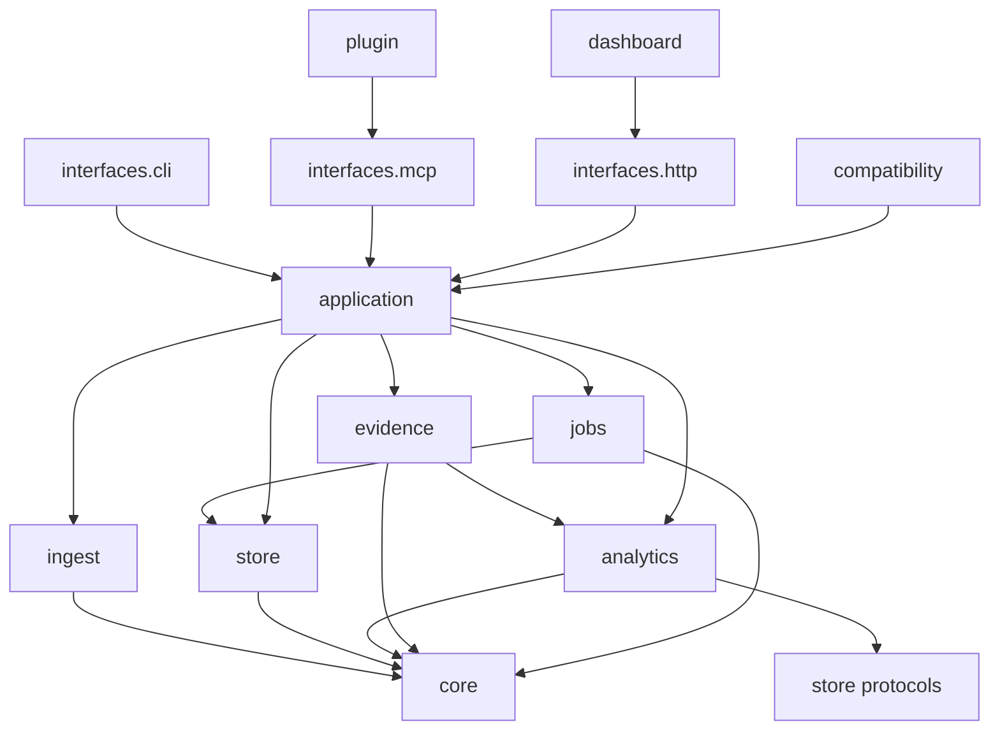

# Codex Usage Tracker MCP-First Product Pivot Design

**Date:** 2026-07-21
**Status:** Proposed implementation contract
**Repository baseline:** `douglasmonsky/codex-usage-tracker` `main` at `bf383e1f4d9e206f3ba8cb004075bc3e87bc3fa6`
**Published baseline:** `codex-usage-tracking==0.21.0`
**Supersedes:** `docs/superpowers/specs/2026-07-19-mcp-first-dashboard-transition-design.md` for all work after its merged foundation release
**Companion implementation roadmap:** `docs/superpowers/plans/2026-07-21-mcp-first-product-pivot.md`

## 1. Executive decision

Codex Usage Tracker will become an **MCP-first, evidence-backed local usage analyst**. The conversational agent becomes the primary interface for diagnosis, comparison, explanation, and recommendation. Deterministic application services remain the source of calculations and classifications. The live React application becomes a narrow **Evidence Console** used to confirm claims, inspect exact calls and threads, view time-series evidence, and manage local setup.

The pivot is not a change from deterministic analytics to free-form LLM analytics. It is the opposite: the product will expose a smaller, more coherent set of deterministic tools so an agent can select and explain the right analysis without asking the user to understand the repository's internal report taxonomy.

The target division of responsibility is:

| Layer | Responsibility |
| --- | --- |
| Agent | Interpret the question, select tools, synthesize findings, explain limitations, and phrase recommendations. |
| MCP application layer | Validate scope, invoke deterministic analytics, classify claims, select evidence, and return bounded structured results. |
| Analytics and persistence | Perform canonical accounting, filtering, grouping, statistical analysis, pricing, allowance analysis, and provenance resolution. |
| Evidence Console | Display exact supporting records and time-series evidence, not independently invent analytical conclusions. |
| CLI | Setup, automation, scripting, recovery, export, and compatibility. |

The stable product should be explainable in one sentence:

> Ask what is driving Codex usage, receive a grounded explanation, and open the exact local evidence behind every material conclusion.

## 2. Why the existing transition is not sufficient

The merged MCP-first foundation correctly introduced route maturity metadata, conversational-readiness checks, dashboard targets, evidence actions, deterministic packaged assets, and release-candidate browser coverage. It intentionally did not change default navigation. The current route catalog still exposes the ten-entry foundation navigation and the MCP server still publishes approximately sixty public tools.

That foundation solved discoverability and handoff mechanics. It did not yet solve the underlying product-complexity problem:

- The README still alternates between describing the dashboard and MCP as the core product.
- Calls, Threads, Diagnostics, Investigate, Compression Lab, Cache and Context, Reports, legacy static output, live React, CLI reports, and MCP tools still compete as peer workflows.
- The MCP surface mirrors implementation history rather than a coherent agent-facing domain model.
- Multiple job systems, report schemas, and route-specific payloads require agents to know which internal subsystem owns a question.
- The Python architecture document is materially stronger than the enforced Tach configuration.
- CI reports coverage but does not directly fail below the intended coverage floor.
- GitHub Actions use mutable version tags rather than immutable commit SHAs.
- The publish workflow does not yet implement a single build promoted unchanged through qualification and publication.

This design completes the pivot rather than merely labeling the existing product.

## 3. Scope

### 3.1 In scope

This program includes:

1. A small default MCP tool profile with stable contracts.
2. A compatibility MCP profile that preserves old tool names during a bounded migration window.
3. A shared response envelope, claim model, evidence model, job model, and dashboard-target model.
4. A deterministic analysis service that replaces the need to understand individual report and diagnostic tools.
5. A simplified Evidence Console with Home, Explore, Limits, and Settings, plus contextual evidence routes.
6. Sunset and eventual deletion of non-core dashboard workspaces and the legacy static dashboard.
7. A simplified CLI hierarchy with stable top-level workflows and namespaced advanced operations.
8. A versioned HTTP API used by both MCP and the Evidence Console.
9. A Python application layer and mechanically enforced dependency boundaries.
10. SQLite foreign-key enforcement and integrity checks.
11. Byte-offset-aware selected-context reads.
12. Direct coverage enforcement, migration tests, contract snapshots, package budgets, action pinning, and a build-once release pipeline.
13. Accurate public statements about what the product stores and exposes.
14. Internal synthetic task evaluation and deterministic acceptance suites.

### 3.2 Explicitly out of scope

This program does not include:

- A new privacy architecture, encryption system, permission model, consent workflow, or data-retention product. Existing behavior must be described accurately, but privacy redesign is outside this program.
- An external user cohort, market validation study, external statistical review, or other external validation program.
- Hosted telemetry, hosted dashboards, account synchronization, or cloud storage.
- A general-purpose agent observability platform supporting arbitrary coding agents.
- Replacing deterministic analytics with LLM arithmetic, free-form SQL generation, or unbounded transcript submission.
- A new frontend framework or a new database engine.
- Rebranding the package or resolving the PyPI name collision in this program.

## 4. Resolved product decisions

The following decisions are normative and require a new design amendment to change.

1. **MCP is the primary analysis interface.**
2. **The dashboard is an Evidence Console, not an analytics notebook.**
3. **The backend, not the model, performs calculations and statistical decisions.**
4. **The default MCP profile exposes seven tools.**
5. **Existing MCP tools remain temporarily available through a full compatibility profile.**
6. **Persistent dashboard navigation exposes Home, Explore, and Limits as analytical destinations plus Settings as a visually separate shell utility action.**
7. **Call and thread evidence remains available through contextual routes.**
8. **Diagnostics Notebook, Investigate, Compression Lab, Cache and Context, and Reports leave default navigation immediately in the first dashboard pivot release.**
9. **Those routes remain direct-link compatibility surfaces for one minor release, become read-only notices for a second minor release, and are then deleted.**
10. **The legacy static dashboard receives no new features and is removed after the same two-release compatibility window.**
11. **The 3D Usage Constellation is removed rather than carried into the stable Evidence Console.**
12. **Every material analytical claim has explicit claim type, confidence, limitations, and evidence references.**
13. **Every evidence reference can produce a deterministic Evidence Console target.**
14. **Long-running operations use one generic job-status contract.**
15. **The CLI preserves scripting capabilities but no longer presents every subsystem as a top-level command.**
16. **Python interfaces call application services rather than storage and report modules directly.**
17. **The project adopts `root_module = "forbid"` and circular-dependency enforcement.**
18. **Coverage, schema migration, contract, package-size, and architecture thresholds are blocking CI gates.**
19. **Release artifacts are built once and promoted unchanged.**
20. **No new dashboard workspace is allowed during the pivot.**

## 5. Product principles

### 5.1 Conversation first, evidence always

The normal workflow starts with a question rather than a page. Every answer should end with one of the following:

- a complete evidence-backed answer;
- a bounded follow-up question needed to disambiguate scope;
- a job identifier with a precise polling instruction; or
- a clear statement that available evidence is insufficient.

The agent must never need to tell the user to manually browse a large diagnostics page to discover the conclusion. Manual browsing exists to verify a conclusion or perform an unusual investigation.

### 5.2 Deterministic calculations

All numeric values, rankings, thresholds, identity decisions, price calculations, allowance decisions, and statistical classifications are produced by deterministic code. The agent may summarize or compare returned values, but tools should return the relevant comparison and derived metrics directly so the agent is not required to perform arithmetic.

### 5.3 Progressive disclosure

The first tool result contains the strongest answer and no more than five findings. Additional evidence is fetched by identifier. Large result sets use pagination or jobs. Raw or highly detailed records remain separate from the default analytical result.

### 5.4 Honest epistemics

Every claim is one of:

- `observed`: directly present in indexed source evidence;
- `derived`: deterministic calculation from observed fields;
- `estimated`: deterministic estimate dependent on a documented model, rate card, or incomplete coverage;
- `inferred`: rule-based interpretation with explicit supporting signals;
- `recommended`: action proposal derived from prior claims.

The product must not visually or structurally flatten these categories into one undifferentiated result.

### 5.5 One concept, one contract

Status, scope, evidence, jobs, targets, warnings, and limitations use shared models across CLI, MCP, HTTP, and frontend. Interface-specific rendering may differ; semantic fields do not.

### 5.6 Compatibility is bounded

Compatibility wrappers have an owner, replacement, first-deprecated release, final-supported release, and removal release. There is no indefinite compatibility surface before 1.0.

### 5.7 Small public surface, rich internal capability

Complex analytics can remain internally available without becoming independent public tools or dashboard pages. New analytical capability should normally become a new `goal` or query dimension, not a new top-level interface.

## 6. Target user journeys

### 6.1 First installation

1. Install the package with `pipx`.
2. Run `codex-usage-tracker setup`.
3. Restart Codex or open a fresh task when instructed.
4. Ask: "What drove my Codex usage this week?"
5. The agent invokes `usage_status`, refreshes if needed, then invokes `usage_analyze`.
6. The response gives a bounded answer and evidence links.
7. The user opens the Evidence Console only when they want to inspect the supporting calls or threads.

The dashboard is not required to obtain the first useful answer.

### 6.2 Usage spike

The user asks why usage increased on a specific day. `usage_analyze(goal="usage_spike")` returns:

- the comparison window;
- absolute and relative change;
- the small number of threads, subagents, models, or behaviors explaining most of the change;
- exact versus estimated fields;
- evidence identifiers and targets;
- a recommendation only when supported by the findings.

### 6.3 Token-waste investigation

The user asks what to change. The analysis service may internally use recommendation facts, compression facts, context-pressure metrics, shell churn, repeated-file evidence, and subagent analytics. The public result is one analysis report, not a tool-selection exercise exposed to the agent.

### 6.4 Precise query

The user asks for a table, such as usage by model and effort for the last seven days. `usage_query` returns grouped deterministic rows with totals, coverage, sort order, and scope. No narrative analysis is required.

### 6.5 Evidence verification

The user asks to verify a particular claim. `usage_evidence` receives a finding, call, thread, or allowance identifier and returns bounded supporting records plus an Evidence Console target. The Evidence Console opens the exact selected state.

### 6.6 Allowance question

The user asks whether weekly capacity changed. `usage_allowance` returns current status, source freshness, qualifying cycles, supported boundaries, caveats, and a Limits target. If analysis is missing, it starts or reuses a generic job and returns a job identifier.

### 6.7 MCP unavailable

`codex-usage-tracker doctor` and the Evidence Console show exact recovery. The CLI remains capable of `analyze`, `query`, and `export` using the same application services. Manual evidence browsing remains useful but is no longer a substitute for the missing conversational layer.

### 6.8 Automation

Scripts call `codex-usage-tracker query --json` or `analyze --json`. The output uses the same semantic contracts as MCP. Automation does not scrape dashboard payloads or invoke compatibility tools.

## 7. Target product surface

### 7.1 Evidence Console routes

| Route | Placement | Lifecycle | Purpose |
| --- | --- | --- | --- |
| `home` | Primary | Stable | Readiness, freshness, headline status, recent high-confidence findings, and suggested questions. |
| `explore` | Primary | Stable | Calls and Threads evidence browser with a mode switch and shared scope. |
| `limits` | Primary | Stable | Current allowance status, history, supported changes, methodology, and evidence. |
| `settings` | Shell utility | Stable | Setup, service, language, local paths, pricing status, and advanced compatibility controls. |
| `evidence` | Contextual | Stable | Finding, call, thread, and allowance evidence details. |
| `diagnostics` | Direct only, then removed | Deprecated | Compatibility notice and links to MCP/CLI replacements. |
| `investigator` | Direct only, then removed | Deprecated | Compatibility notice; deterministic investigation moves to MCP. |
| `compression-lab` | Direct only, then removed | Deprecated | Compatibility notice; analysis remains a backend strategy. |
| `cache-context` | Direct only, then removed | Deprecated | Compatibility notice and mapped analysis goals. |
| `reports` | Direct only, then removed | Deprecated | Compatibility notice and mapped query/analyze/export workflows. |
| legacy static dashboard | Compatibility entry point, then removed | Deprecated | Frozen output only during migration. |

`home`, `explore`, `limits`, `settings`, and `evidence` are the only routes that receive new product features during the pivot.

### 7.2 Explore modes

`explore` has two modes:

- `calls`: the existing high-density calls table and selected-call summary;
- `threads`: the existing thread ranking and bounded call expansion.

The mode is URL-addressable with `mode=calls|threads`. Shared time scope, history scope, project filters, and search persist when switching modes. Mode-specific filters are dropped deterministically.

### 7.3 Contextual evidence

The existing Call Investigator functionality becomes part of a generalized evidence route. The first implementation may keep `view=call` as a compatibility alias, but the target contract uses:

- `kind=call&record_id=...`;
- `kind=thread&thread_key=...`;
- `kind=finding&analysis_id=...&finding_id=...`;
- `kind=allowance&evidence_id=...`.

The evidence route renders aggregate evidence first and keeps existing explicit local-context controls unchanged.

### 7.4 Removed dashboard features

The following are not migrated into the stable console:

- 3D Usage Constellation;
- Diagnostics Notebook navigation and report-grid UI;
- Investigate workbench UI;
- Compression Lab orchestration UI;
- Cache and Context standalone UI;
- Reports library UI;
- Files, Commands, and Models navigation aliases;
- legacy static interactive navigation.

Backend calculations may remain if they support a core MCP goal or evidence record.

## 8. Target MCP contract

### 8.1 Default core tools

The default plugin profile exposes exactly seven tools.

| Tool | Purpose | Long-running behavior |
| --- | --- | --- |
| `usage_status` | Read freshness, coverage, configuration readiness, tool profile, and next action. | Never starts work. |
| `usage_refresh` | Refresh usage indexes synchronously when bounded or start a refresh job. | May return a completed result or `job_id`. |
| `usage_analyze` | Answer a goal-oriented analytical question using deterministic services. | May return a completed report or `job_id`. |
| `usage_query` | Return precise grouped or record-level aggregate data. | Synchronous and bounded. |
| `usage_evidence` | Expand a selected finding, call, thread, or allowance claim. | Synchronous and bounded. |
| `usage_allowance` | Read current allowance state and analysis; start analysis when necessary. | May return a completed result or `job_id`. |
| `usage_job_status` | Poll any job created by the other core tools. | Read only. |

### 8.2 Tool profiles

The MCP server supports three profiles.

| Profile | Default use | Contents |
| --- | --- | --- |
| `core` | Installed plugin | Seven stable tools only. |
| `full` | Compatibility and advanced local automation | Core tools plus supported old public tools with deprecation metadata. |
| `developer` | Maintainer development | Full profile plus dogfood, visualization experiments, diagnostics internals, and test tools. |

The installed plugin launcher sets `CODEX_USAGE_TRACKER_MCP_PROFILE=core` unless explicitly overridden. `codex-usage-tracker admin mcp serve --profile full` is the documented compatibility entry point.

### 8.3 Tool catalog

Every tool is registered from a declarative catalog:

```python
class ToolSpec(TypedDict):
    name: str
    minimum_profile: Literal["core", "full", "developer"]
    maturity: Literal["stable", "beta", "experimental"]
    lifecycle: Literal["active", "deprecated"]
    data_class: Literal["aggregate", "local_index", "raw_context", "administrative"]
    replacement: str | None
    deprecated_since: str | None
    remove_after: str | None
    handler: Callable[..., object]
```

A tool is included in its minimum profile and every more permissive profile. Registration order is stable and tested. Tool catalog output is included in `usage_status` and generated into the MCP documentation. The core profile cannot accidentally grow without updating an exact snapshot test.

### 8.4 Analysis goals

`usage_analyze` accepts a closed set of goals:

- `usage_spike`;
- `token_waste`;
- `context_bloat`;
- `cache_failure`;
- `subagent_cost`;
- `fast_usage`;
- `pricing_gaps`;
- `thread_comparison`;
- `model_effort_mix`;
- `workflow_churn`.

A new goal requires a contract test, deterministic fixture, evidence mapping, documentation, and an explicit statement explaining why an existing goal cannot represent the question.

### 8.5 Query entities and measures

`usage_query` supports these entities:

- `call`;
- `thread`;
- `subagent`;
- `model`;
- `effort`;
- `project`;
- `origin`;
- `service_tier`.

Supported measures include:

- input, cached input, uncached input, output, reasoning, and total tokens;
- calls and observed subagent sessions;
- estimated cost and usage credits;
- duration and inter-call gap where available;
- cache ratio and context pressure;
- priced and unpriced coverage.

All filters are allowlisted and typed. Every query result is limited to 200 rows or groups per page, with smaller defaults. Unlimited interactive requests are rejected.

## 9. Shared response contract

### 9.1 Envelope

Every core MCP tool returns `codex-usage-tracker.mcp-envelope.v1`.

```python
class McpEnvelopeV1(TypedDict):
    schema: Literal["codex-usage-tracker.mcp-envelope.v1"]
    tool: str
    request_id: str
    generated_at: str
    source_revision: str | None
    freshness: FreshnessV1
    scope: ScopeV1
    data_class: Literal["aggregate", "local_index", "raw_context", "administrative"]
    accounting: AccountingContextV1
    warnings: list[MessageV1]
    limitations: list[MessageV1]
    result_schema: str
    result: object
    dashboard_targets: list[DashboardTargetV2]
    next_actions: list[NextActionV1]
```

The envelope is additive around a versioned result payload. Compatibility wrappers may continue returning their historical payloads until removal, but core tools always use the envelope.

### 9.2 Freshness

`FreshnessV1` contains:

- latest indexed event timestamp;
- source revision;
- refresh completed timestamp;
- state: `fresh`, `aging`, `stale`, `empty`, or `unknown`;
- reason;
- recommended refresh action.

Each domain may define a freshness threshold, but it must report the threshold and reason.

### 9.3 Accounting context

`AccountingContextV1` contains:

- physical row count considered;
- canonical row count considered;
- copied rows excluded;
- pricing coverage;
- credit coverage;
- service-tier coverage;
- selected history scope;
- selected privacy mode.

Fields that do not apply are `null`; they are not silently omitted.

### 9.4 Messages

Warnings and limitations use stable codes rather than prose-only strings:

```python
class MessageV1(TypedDict):
    code: str
    severity: Literal["info", "warning", "blocking"]
    message: str
    remediation: str | None
```

Agents may paraphrase the message but should retain the code when reporting a blocking limitation.

## 10. Claim and evidence model

### 10.1 Findings

```python
class FindingV1(TypedDict):
    finding_id: str
    title: str
    claim_type: Literal["observed", "derived", "estimated", "inferred", "recommended"]
    severity: Literal["info", "low", "medium", "high"]
    confidence: Literal["exact", "high", "medium", "low", "unknown"]
    statement: str
    metrics: dict[str, int | float | str | None]
    evidence_ids: list[str]
    caveat_codes: list[str]
    recommendation: RecommendationV1 | None
```

A recommendation cannot be the only finding. It must reference at least one observed, derived, estimated, or inferred finding.

### 10.2 Evidence records

```python
class EvidenceV1(TypedDict):
    evidence_id: str
    kind: Literal["call", "thread", "subagent", "time_bucket", "allowance_cycle", "diagnostic_fact", "aggregate_comparison"]
    label: str
    selectors: dict[str, str]
    metrics: dict[str, int | float | str | None]
    source_schema: str
    dashboard_target: DashboardTargetV2 | None
```

Evidence identifiers are deterministic within an analysis result. `usage_evidence` accepts `analysis_id` plus `evidence_id`, or a canonical record/thread/allowance selector.

### 10.3 Analysis report

```python
class AnalysisReportV2(TypedDict):
    schema: Literal["codex-usage-tracker.analysis.v2"]
    analysis_id: str
    goal: str
    summary: str
    findings: list[FindingV1]
    evidence: list[EvidenceV1]
    methodology: list[str]
    suggested_questions: list[str]
```

A compact report returns at most five findings and ten evidence records. `usage_evidence` expands selected evidence rather than allowing the initial report to grow without bound.

## 11. Generic job model

Long-running operations currently use several independent registries and schemas. The target interface presents one model even while internal adapters continue using existing storage.

```python
class JobStatusV1(TypedDict):
    schema: Literal["codex-usage-tracker.job.v1"]
    job_id: str
    kind: Literal["refresh", "analysis", "allowance", "compression", "diagnostic"]
    state: Literal["queued", "running", "completed", "failed", "cancelled"]
    progress_percent: int
    stage: str
    source_revision: str | None
    request_hash: str
    created_at: str
    updated_at: str
    completed_at: str | None
    retryable: bool
    error: MessageV1 | None
    result_schema: str | None
    result: object | None
```

Requirements:

- identical long-running requests for the same source revision reuse active or completed jobs;
- progress is monotonic;
- status is bounded and never includes large result payloads unless `include_result=true` and the job is complete;
- failures use stable error codes;
- the generic facade can adapt existing refresh, allowance, compression, and diagnostic jobs before their storage is consolidated;
- the final target persists generic job metadata and bounded results in SQLite.

## 12. Dashboard target v2

`codex-usage-tracker-dashboard-target-v2` replaces route-specific v1 assumptions with an evidence-oriented descriptor.

```python
class DashboardTargetV2(TypedDict):
    schema: Literal["codex-usage-tracker-dashboard-target-v2"]
    surface: Literal["home", "explore", "limits", "settings", "evidence"]
    evidence_kind: Literal["call", "thread", "finding", "allowance", "none"]
    selectors: dict[str, str]
    scope: ScopeV1
    relative_url: str
    absolute_url: str | None
    fallback_instruction: str | None
```

The builder accepts only reviewed selectors and filters. Existing v1 targets remain readable and are normalized to v2 in the frontend. New core tools emit v2 only.

Resolution order remains:

1. healthy persistent Evidence Console service;
2. explicitly known active loopback server;
3. relative target plus `codex-usage-tracker open` fallback.

## 13. Target backend architecture

### 13.1 Package model

```text
codex_usage_tracker/
  core/                 Pure value objects, contracts, identifiers, time, paths
  ingest/               JSONL and OTel parsing, source cursors, normalization
  store/                SQLite connections, migrations, repositories, query plans
  analytics/            Deterministic domain analysis and statistics
  evidence/             Findings, evidence records, targets, evidence expansion
  jobs/                 Generic job facade, persistence, adapters, workers
  application/          Use cases consumed by every interface
  interfaces/
    cli/                 Argument parsing and rendering only
    mcp/                 Tool registration and MCP adapters only
    http/                HTTP routing and serialization only
  dashboard/            Live shell payloads and packaged Evidence Console assets
  plugin/               Plugin wrapper, launcher metadata, bundled skills
  compatibility/        Temporary pre-1.0 aliases and payload adapters
```

The existing packages are migrated incrementally. A large flag-day move is prohibited.

### 13.2 Dependency direction



The arrows describe allowed dependencies from lower-level provider to higher-level consumer in the diagram; the enforced Tach declarations list each consumer's allowed dependencies explicitly.

Normative rules:

- `core` imports no project package outside `core`.
- `store` imports `core`, never `analytics`, `application`, or an interface.
- `analytics` imports `core` and repository protocols; concrete SQLite access is injected through application services or narrow repository modules.
- `evidence` imports `core` and analytics result models, not CLI, MCP, HTTP, or React concepts.
- `application` owns orchestration and is the only layer allowed to combine ingest, store, analytics, evidence, and jobs.
- interfaces import `application` and `core` contracts only.
- interfaces do not import one another.
- compatibility wrappers may import interfaces temporarily but cannot be imported by stable packages.
- frontend calculations remain presentational only.

### 13.3 Application services

The stable use cases are:

```python
get_status(request: StatusRequest) -> StatusResult
refresh_usage(request: RefreshRequest) -> CompletedOrJob[RefreshResult]
analyze_usage(request: AnalysisRequest) -> CompletedOrJob[AnalysisReportV2]
query_usage(request: QueryRequest) -> QueryResultV2
get_evidence(request: EvidenceRequest) -> EvidenceResultV1
get_allowance(request: AllowanceRequest) -> CompletedOrJob[AllowanceResultV3]
get_job_status(request: JobStatusRequest) -> JobStatusV1
```

CLI, MCP, and HTTP adapters invoke these functions. No interface reconstructs reports independently.

## 14. HTTP API v2

The Evidence Console and MCP adapters share application services, but the live frontend receives a small HTTP surface.

| Method | Route | Use case |
| --- | --- | --- |
| `GET` | `/api/v2/status` | `get_status` |
| `POST` | `/api/v2/refresh` | `refresh_usage` |
| `POST` | `/api/v2/analyze` | `analyze_usage` |
| `POST` | `/api/v2/query` | `query_usage` |
| `POST` | `/api/v2/evidence` | `get_evidence` |
| `POST` | `/api/v2/allowance` | `get_allowance` |
| `GET` | `/api/v2/jobs/{job_id}` | `get_job_status` |

Existing routes remain available during the compatibility window and call the same application services where practical. The route inventory records `stable`, `compatibility`, or `developer` exposure. New stable frontend code may not call a v1 compatibility route.

The existing loopback, Host, Origin, and token checks remain unchanged.

## 15. Target CLI

### 15.1 Stable top-level commands

```text
setup
status
doctor
refresh
open
analyze
query
export
config
service
admin
```

Normal users need only `setup`, `status`, `doctor`, `refresh`, `open`, `analyze`, and `query`.

### 15.2 Namespaces

`export`:

- `csv`;
- `json`;
- `html` evidence report.

`service`:

- `install`;
- `status`;
- `uninstall`.

`config`:

- `pricing`;
- `rate-card`;
- `allowance`;
- `projects`;
- `thresholds`.

`admin`:

- `mcp serve --profile core|full|developer`;
- `mcp tools --profile ... --json`;
- `rebuild-index`;
- `reset-db`;
- `inspect-log`;
- `support-bundle`;
- `dedupe-diagnostics`;
- `source-coverage`.

Old top-level commands remain aliases for two minor releases. Human output includes one deprecation line on stderr. JSON output remains unchanged except for an additive `deprecation` object where the historical schema permits it; otherwise the warning is stderr-only.

## 16. Storage and integrity changes

### 16.1 Foreign-key enforcement

Every SQLite connection executes and verifies:

```sql
PRAGMA foreign_keys = ON;
PRAGMA busy_timeout = 5000;
```

`doctor`, migration CI, and release checks execute `PRAGMA foreign_key_check`. A nonempty result is blocking.

### 16.2 Integrity checks

Release and migration tests run:

```sql
PRAGMA integrity_check;
PRAGMA foreign_key_check;
```

`integrity_check` must return exactly `ok`.

### 16.3 Generic analysis persistence

A new migration introduces:

- `analysis_reports` for compact completed analysis envelopes;
- `analysis_evidence` for bounded evidence records;
- `analysis_jobs` for generic job metadata and compact results.

Rows are keyed by request hash plus source revision. Existing domain-specific tables remain until their consumers move; duplicate persistence is not introduced merely for uniformity.

### 16.4 Context byte offsets

Selected-call context currently scans from the beginning of a JSONL file to a target line. A new additive column stores the byte offset of the selected token event. The parser records offsets during normal sequential parsing. Context reads:

1. validate source identity and size metadata;
2. seek to a bounded earlier offset or a per-turn anchor;
3. scan a bounded neighborhood;
4. fall back to the existing sequential algorithm when validation fails.

Correctness is more important than the optimization; the fallback remains tested.

## 17. Frontend architecture

### 17.1 Stable feature packages

```text
frontend/dashboard/src/
  app/
  data/contracts/
  data/queries/
  features/home/
  features/explore/
    calls/
    threads/
  features/limits/
  features/evidence/
  features/settings/
  components/
  design/
```

Compatibility routes live temporarily under `features/compatibility/` and may import only shared transition components and route actions. Stable features never import compatibility features.

### 17.2 State ownership

- URL state owns selected route, mode, scope, filters, and selected evidence.
- TanStack Query owns server state.
- Shell state owns language and local UI preferences.
- No analytical result is recomputed independently in React.
- Compatibility-route state is not persisted.

### 17.3 Dependency cleanup

After the Usage Constellation and legacy routes are removed:

- remove `three` and `@types/three` unless a remaining stable route imports them;
- remove unused D3 packages after Knip and bundle analysis;
- lazy-load ECharts only for Limits if it remains the only ECharts consumer;
- delete generated chunks for removed routes;
- reduce locale catalogs to stable shell and Evidence Console copy;
- enforce wheel, sdist, and JavaScript bundle budgets.

## 18. Compatibility and sunset policy

### 18.1 Release stages

| Stage | Behavior |
| --- | --- |
| Pivot Release 1 | Core MCP profile ships; existing dashboard remains but product copy becomes MCP-first. |
| Pivot Release 2 | Simplified Evidence Console becomes default; old pages are direct-link compatibility routes with replacement notices. |
| Pivot Release 3 | Old pages become notice-only routes; old MCP tools and CLI commands remain in compatibility profiles. |
| Pivot Release 4 | Deprecated dashboard code, legacy static dashboard, old API routes, and expired aliases are removed. |
| Stabilization Release | No new feature surface; contracts, migrations, docs, and package footprint are stabilized for 1.0. |

Starting from the current `0.21.0` baseline, these are intended to be `0.22.0` through `0.26.0`. If another release is published before execution begins, the version numbers shift upward while the stage order and compatibility duration remain unchanged.

### 18.2 Deprecation record

Every deprecated item is listed in `docs/deprecations.md` with:

- public name or route;
- replacement;
- deprecated release;
- final supported release;
- removal release;
- compatibility test;
- migration example.

### 18.3 No silent semantic changes

A compatibility wrapper may rename or reshape a request only when a deterministic adapter proves semantic equivalence. If equivalence cannot be proven, the old behavior remains until removal or receives a documented breaking-change notice.

## 19. CI and infrastructure design

### 19.1 Required CI groups

| Group | Responsibilities |
| --- | --- |
| `python-matrix` | Python 3.10-3.14 functional tests and compile checks. |
| `python-quality` | Ruff, whole-source Pyright, Mypy, coverage floor, dead code, dependency hygiene. |
| `architecture-contracts` | Tach, JSON contracts, MCP tool catalog snapshot, route inventory, deprecation catalog. |
| `database-migrations` | Upgrade fixtures, foreign-key checks, integrity checks, rebuild parity. |
| `mcp-core` | Seven-tool profile, envelope contracts, synthetic agent task suite, payload budgets. |
| `mcp-compatibility` | Old tools, deprecation metadata, semantic adapters. |
| `dashboard-core` | Home, Explore, Limits, Settings, Evidence unit and browser tests. |
| `dashboard-compatibility` | Direct old routes during supported releases only. |
| `performance` | 100k route/query budget, refresh budget, selected-context offset budget. |
| `policy-security` | Secrets, workflow policy, schema validation, package policy. |
| `package` | Deterministic assets, wheel/sdist, installed smoke, size budgets. |

### 19.2 Coverage

Set `fail_under = 85` in `[tool.coverage.report]`. The coverage job fails directly below 85%. Changed behavior must satisfy the existing 90% changed-line target through Agent Maintainer or a direct diff-coverage gate.

### 19.3 Immutable actions

Every third-party GitHub Action reference is pinned to a full commit SHA with a version comment. The release check rejects tag-only references.

### 19.4 Build once, promote unchanged

The publication workflow:

1. checks out the exact tag;
2. runs all release gates;
3. builds React assets once;
4. builds wheel and sdist once;
5. records SHA-256 hashes and source commit in a release manifest;
6. installs and smokes the exact local wheel;
7. publishes the exact artifacts to TestPyPI;
8. installs from TestPyPI and verifies version and package contents;
9. waits on the protected PyPI environment approval;
10. publishes the same artifact files to PyPI;
11. attaches the same files and manifest to the GitHub release.

No second build occurs between TestPyPI and PyPI.

### 19.5 Package budgets

Initial blocking budgets are based on the first clean build after Pivot Release 1 and may only decrease without an explicit change plan:

- wheel size baseline plus 5%;
- sdist size baseline plus 5%;
- main Evidence Console JavaScript entry plus 10%;
- Limits lazy chunk plus 10%;
- total stable-route JavaScript plus 5%;
- no removed-route chunk in the package manifest.

## 20. Documentation design

### 20.1 README hierarchy

The README leads with:

1. conversational usage analysis;
2. quick install and setup;
3. starter questions;
4. example grounded answer and evidence link;
5. Evidence Console as verification companion;
6. accurate local storage statement;
7. CLI and automation links.

The phrase “dashboard is the core product surface” is removed.

### 20.2 Required documents

- `docs/mcp.md`: primary product and tool guide;
- `docs/evidence-console.md`: stable UI guide;
- `docs/cli-reference.md`: stable, advanced, and deprecated CLI;
- `docs/contracts.md`: envelope, analysis, query, evidence, job, and target contracts;
- `docs/deprecations.md`: bounded migration ledger;
- `docs/architecture.md`: target layers and extension rules;
- `docs/data-posture.md`: accurate description of stored and shareable data;
- `docs/releases/...`: migration notes per pivot release.

The dedicated privacy documentation may remain, but no public page may contradict the actual default storage model.

## 21. Internal evaluation

External validation is outside scope. The repository nevertheless requires deterministic internal evaluation.

### 21.1 Golden-question suite

A synthetic fixture supports at least these questions:

1. What drove usage this week?
2. Why was yesterday higher than the comparison period?
3. Which threads account for most usage?
4. Are subagents materially contributing?
5. Which model and effort combination is most expensive?
6. Where is cache reuse poor?
7. Which calls show context bloat?
8. Is Fast usage confirmed or unknown?
9. Which costs are estimated or unpriced?
10. Did weekly allowance capacity change?
11. What should I change first?
12. Open the exact evidence for the strongest finding.

For each question, tests assert tool sequence, result schema, expected finding IDs, claim types, evidence IDs, target selectors, warning codes, and maximum payload bytes.

### 21.2 Payload budgets

- `usage_status`: 16 KiB maximum;
- compact `usage_analyze`: 64 KiB maximum;
- `usage_query`: 256 KiB maximum per page;
- `usage_evidence`: 128 KiB maximum;
- `usage_allowance`: 128 KiB maximum;
- job status without result: 16 KiB maximum.

### 21.3 Tool-call budget

A normal golden-question investigation completes in no more than four core tool calls, excluding job polling. Polling uses one generic status tool.

### 21.4 Self-analysis overhead

The tracker marks its own analysis-related sessions when reliably identifiable and can report their aggregate usage separately. This is descriptive only and must not silently exclude those calls from normal totals.

## 22. Governance and autonomous execution rules

1. Each roadmap task is implemented in a fresh branch or worktree.
2. One pull request delivers one independently testable task or a tightly coupled pair explicitly named in the roadmap.
3. Generated dashboard assets do not count toward human review limits but must be generated in a separate commit.
4. Normal PR limit: 25 non-generated files and 1,500 changed non-generated lines.
5. Schema, public contract, release, or compatibility changes require a named reviewer other than the implementer before merge.
6. Every behavior task follows red-green-refactor and includes exact focused tests.
7. New core tools, routes, top-level commands, dependencies, and schema tables are forbidden unless already specified here or approved through an amendment.
8. A failing compatibility or migration test blocks removal even when the new path passes.
9. Agents must not weaken thresholds, expand allowlists, or add broad suppressions to complete a task.
10. Every task updates the roadmap execution ledger with commit, tests, deviations, and remaining risks.

## 23. Risks and mitigations

| Risk | Mitigation |
| --- | --- |
| MCP tool simplification removes useful capability | Preserve deterministic backend services and full profile during the compatibility window. |
| One generic analysis tool becomes an opaque monolith | Closed goal catalog, per-goal strategies, typed requests, shared report model, and focused tests. |
| Agent explanations overstate evidence | Claim types, confidence, stable limitation codes, and exact evidence references. |
| Dashboard removal creates support dead ends | Direct-route notices, CLI parity, Evidence Console targets, and compatibility tests before deletion. |
| Architecture refactor destabilizes behavior | Introduce application facades first, move one interface at a time, and retain compatibility adapters. |
| Generic jobs duplicate existing persistence | Start with adapters; migrate storage only after the facade is stable. |
| Release workflow becomes too slow | Parallel verification before the single build; artifact promotion avoids repeated builds. |
| Package remains heavy after dashboard reduction | Explicit asset deletion, dependency cleanup, and blocking size budgets. |
| Documentation drifts again | Generate tool and deprecation tables from catalogs and test key product statements. |
| Rapid release cadence prevents stabilization | One minor release per stage and a final feature-free stabilization release. |

## 24. Definition of done

The pivot is complete only when all conditions are true:

- The installed plugin defaults to exactly seven core MCP tools.
- The core tools use shared envelope, claim, evidence, job, scope, and target contracts.
- Existing public tools are either removed or available only through a documented compatibility profile within their support window.
- The live Evidence Console has only Home, Explore, and Limits in primary navigation; Settings is a shell action; evidence is contextual.
- Diagnostics Notebook, Investigate, Compression Lab, Cache and Context, Reports, aliases, Usage Constellation, and legacy static dashboard source are deleted.
- CLI normal workflows are stable and advanced operations are namespaced.
- MCP, CLI, and HTTP all call the same application services.
- New stable frontend code calls only `/api/v2` routes.
- Tach forbids undeclared root modules and circular dependencies.
- SQLite foreign keys are enabled and integrity checks pass in CI.
- Selected-context reads use validated byte offsets with tested fallback.
- Coverage fails below 85%; changed-code coverage remains at least 90%.
- GitHub Actions are pinned to immutable SHAs.
- TestPyPI and PyPI receive byte-identical wheel and sdist artifacts.
- Package and bundle budgets pass.
- Public documentation consistently describes MCP as primary, the Evidence Console as supporting evidence, and the actual local storage behavior accurately.
- The golden-question suite passes within payload and tool-call budgets.
- The final stabilization release adds no new product surface.

## 25. Baseline file map

The implementation roadmap assumes these current source areas:

- MCP: `src/codex_usage_tracker/cli/mcp_*.py`, `src/codex_usage_tracker/mcp_server.py`, `skills/codex-usage-*/`;
- reports and analytics: `src/codex_usage_tracker/reports/`, `allowance_intelligence/`, `compression/`, `diagnostics/`, `usage_drain/`;
- persistence: `src/codex_usage_tracker/store/`, `core/schema.py`;
- HTTP: `src/codex_usage_tracker/server/`;
- dashboard source: `frontend/dashboard/src/`;
- packaged assets: `src/codex_usage_tracker/plugin_data/dashboard/`;
- CLI: `src/codex_usage_tracker/cli/parser*.py`, `commands*.py`, `main.py`;
- contracts: `src/codex_usage_tracker/core/json_contract*.py`, `docs/cli-json-schemas.md`;
- CI and release: `.github/workflows/`, `scripts/check_release.py`, `scripts/smoke_installed_package.py`;
- architecture: `docs/architecture.md`, `tach.toml`, `dependency-cruiser.config.cjs`.

This design is the authoritative target. The companion roadmap is the authoritative implementation order.
