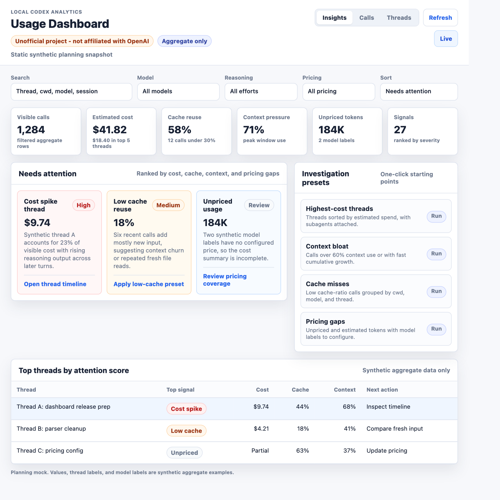
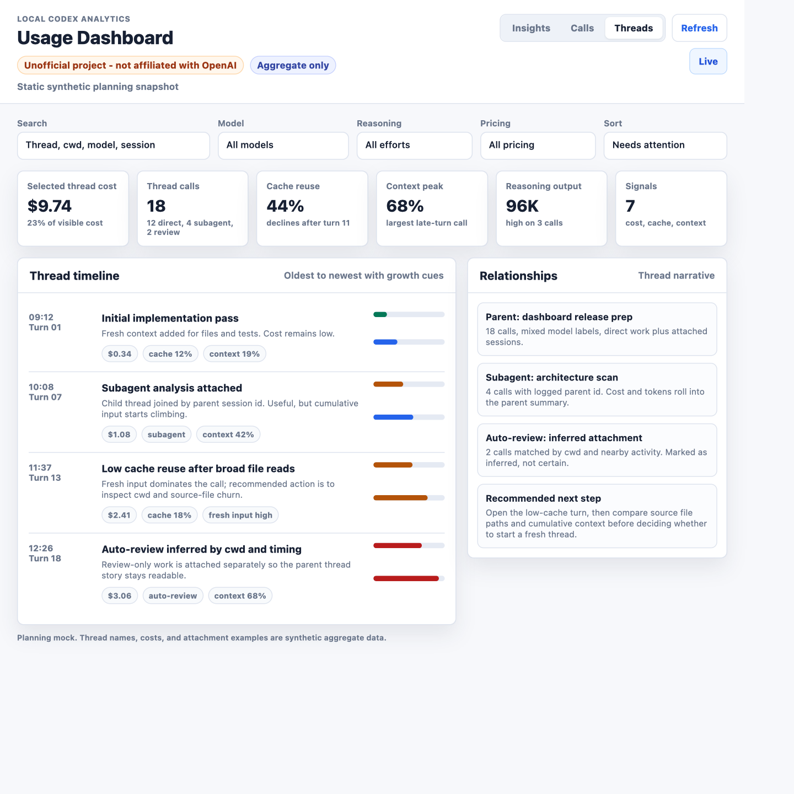
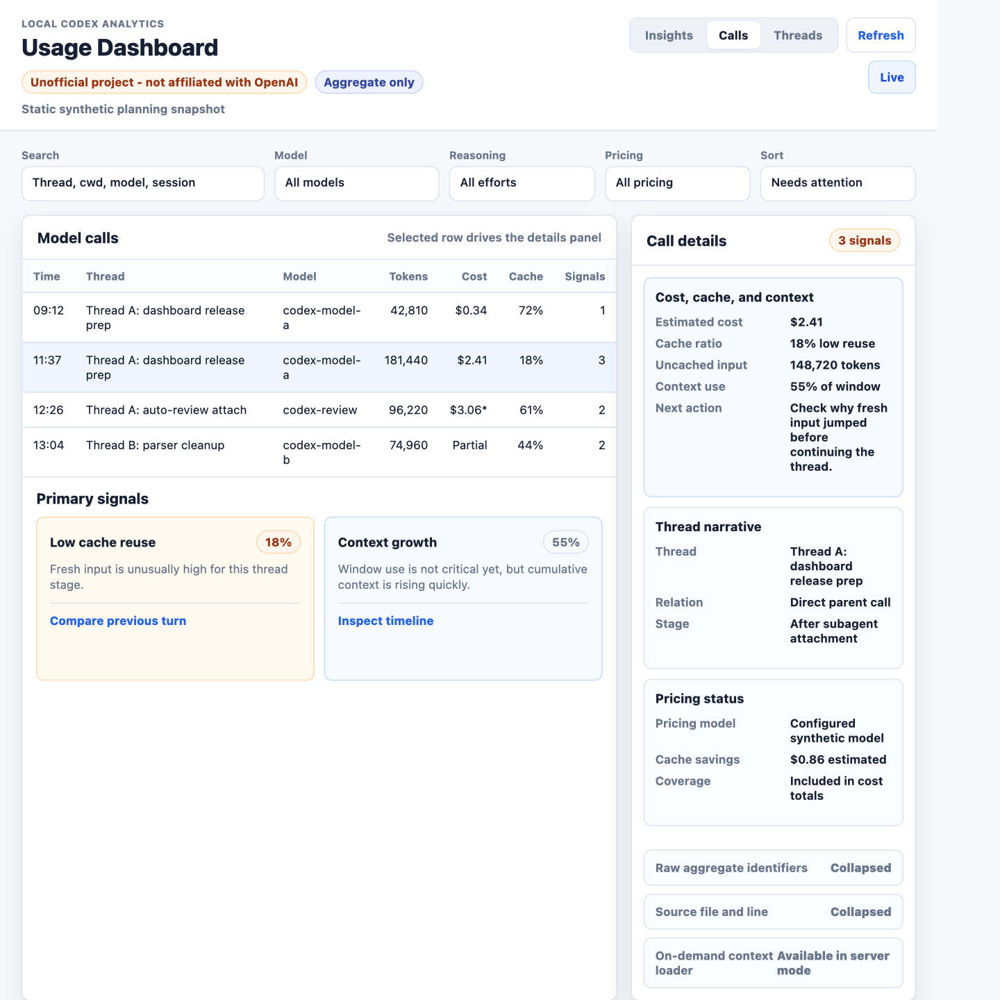

# Insight-First Dashboard UI/UX Improvement Plan

This plan covers the next dashboard product direction for Codex Usage Tracker. It is planning-only: no production dashboard UI is implemented on this branch.

All mock images in this document use synthetic aggregate examples only. They do not include real session logs, prompts, assistant text, tool output, pasted secrets, raw transcript snippets, or private data.

## Product Goal

Help users quickly identify costly threads, low cache reuse, context bloat, unpriced usage, and the next investigative action without making them manually sort and scan dense tables first.

## Current-State Assessment

The current dashboard has strong foundations:

- The privacy model is clear and useful. The generated dashboard and stored index stay aggregate-only, while raw context is loaded lazily from localhost only when explicitly requested.
- The Calls and Threads split is the right primary information architecture. Individual call inspection and grouped thread investigation are distinct jobs, and the product already exposes both.
- The dashboard already tracks high-value signals: estimated cost, pricing status, cache ratio, reasoning output, context-window pressure, subagent relationships, and inferred auto-review attachment.
- The compact operational visual system works well for a local analysis tool: light palette, Inter/system font stack, restrained borders, 8px radii, dense tables, and sticky details.

The main UX gap is signal discovery:

- The dashboard is too table-first. Users must know which column to sort, which filter to apply, and how to combine fields before they see what needs attention.
- Summary cards describe totals, but they do not explain what changed, which threads caused it, or what action to take next.
- Thread rows are useful aggregates, but the narrative of cost growth, cache decline, context expansion, subagent work, and auto-review attachment is still hard to read at a glance.
- The details panel exposes important fields, but its flat field list creates overload. Primary cost, context, cache, pricing, and thread-relationship signals should appear before secondary identifiers and raw aggregate metadata.
- Pricing gaps are visible after filtering, but unpriced or estimated usage should be treated as an explicit data-quality insight because it affects cost confidence.

## Design Principles

1. Prioritize actionable signals.
   - Lead with "what needs attention" rather than only aggregate totals.
   - Rank insights by severity using a transparent mix of cost, cache reuse, context pressure, pricing coverage, and signal count.
   - Pair each insight with a clear next action, such as opening a thread timeline, applying a preset, reviewing pricing coverage, or comparing fresh input.

2. Use progressive disclosure.
   - Keep the high-level dashboard fast to scan.
   - Let users move from insight card to filtered table to thread timeline to call detail without losing context.
   - Collapse secondary raw identifiers until the user needs them.

3. Add scenario presets.
   - Provide one-click starting points for common investigations: highest-cost threads, context bloat, cache misses, unpriced usage, and estimated-price review.
   - Presets should change filters, sort order, active view, and explanatory captions together.

4. Make thread narratives readable.
   - Show thread growth oldest-to-newest with cost, cache, context, and relationship cues.
   - Keep direct parent calls, logged subagents, and inferred auto-review sessions visibly distinct.
   - Mark inferred relationships as inferred, not certain.

5. Reduce detail-panel overload.
   - Promote primary signals: estimated cost, cache ratio, uncached input, context use, pricing status, and recommended next action.
   - Group thread narrative, token breakdown, pricing, and source metadata into sections.
   - Collapse raw aggregate identifiers and source file metadata by default.

## Visual Mocks

### Insight Overview

Direction:

- Add an insight-first dashboard state above the existing tables.
- Keep aggregate summary cards, but pair them with ranked "Needs attention" cards.
- Add investigation presets so users can jump directly into common workflows.
- Preserve the current operational density and visual system.

### Thread Investigation

Direction:

- Keep Threads as the core investigation view, but add an optional selected-thread narrative panel.
- Show calls oldest-to-newest with cost, cache, and context growth bars.
- Surface direct, subagent, and inferred auto-review relationships in a side panel.
- Make the next investigative step visible before users load raw context.

### Call Detail Panel

Direction:

- Restructure details around primary signals first.
- Show selected-row explanation, then grouped sections for thread narrative and pricing status.
- Collapse raw aggregate identifiers, source file and line metadata, and context-loader controls below the primary decision content.
- Keep the details panel compact, sticky, and compatible with the current table workflow.

## Prioritized Roadmap

### Phase 1: Quick Polish

- Tighten table captions so they explain the active view, filter, sort, and pricing confidence.
- Add clearer empty states for no matching calls, no matching threads, and unconfigured pricing.
- Improve signal labels so "low cache", "high context", "unpriced", "estimated price", and "review attachment inferred" are consistently named across Calls, Threads, and Details.
- Keep this phase low-risk by preserving current data shape and controls.

Acceptance criteria:

- Existing Calls and Threads workflows still work.
- No raw context is embedded in generated dashboard HTML.
- Existing tests and release checks pass.

### Phase 2: Insight Summary Band

- Add ranked insight cards above the table.
- Compute insight candidates from aggregate rows only.
- Include at least these insight types: highest-cost thread, low-cache calls, high context use, unpriced usage, estimated-price usage, and reasoning-output spikes.
- Each insight card includes severity, evidence, affected thread/call count, and next action.

Acceptance criteria:

- Users can identify the top three issues without sorting the table.
- Insight cards update with filters and loaded row count.
- All insight evidence comes from existing aggregate fields or new aggregate-only derived fields.

### Phase 3: Investigation Presets

- Add preset buttons for highest-cost threads, context bloat, cache misses, pricing gaps, and estimated-price review.
- Presets set active view, filters, sort order, and table caption together.
- Presets are reversible and do not hide the underlying standard filters.

Acceptance criteria:

- Each preset has deterministic behavior.
- Presets can be tested without a browser by asserting derived dashboard state.
- The UI still supports manual search, filtering, sorting, and pagination.

### Phase 4: Thread Timeline Improvements

- Add selected-thread summary state in Threads view.
- Show chronological call growth with cost, cache, context, reasoning output, and relationship cues.
- Distinguish direct parent calls, logged subagents, spawned child threads, and inferred auto-review sessions.

Acceptance criteria:

- A user can explain why a thread became expensive from the timeline without opening raw context.
- Inferred relationships are clearly labeled as inferred.
- Thread grouping still respects current parent-session and cwd/timing inference behavior.

### Phase 5: Detail Panel Restructuring

- Split details into grouped sections: primary signals, thread narrative, token/context breakdown, pricing status, source metadata, and on-demand context.
- Collapse secondary raw aggregate fields by default.
- Keep context-loading explicit, localhost-only, redacted, and never persisted.

Acceptance criteria:

- The first visible details section answers: "why should I care about this call?"
- Raw identifiers remain available for debugging.
- Context loading behavior and privacy guarantees remain unchanged.

### Phase 6: Mobile And Responsive Pass

- Rework filters, cards, tables, timeline, and details for narrow screens.
- Make horizontal table overflow deliberate and readable.
- Ensure sticky details do not trap content on small screens.

Acceptance criteria:

- No clipped text, overlapping controls, or inaccessible details on common mobile widths.
- Keyboard and screen-reader access remain at least as good as the current dashboard.
- Desktop density is not sacrificed for the mobile layout.

## Implementation Notes

- Prefer small, testable dashboard-state helpers over adding a large front-end framework.
- Keep insight ranking deterministic and easy to explain.
- Treat aggregate-only derived signals as part of the dashboard payload contract only when needed; avoid storing new data unless it improves testability or performance.
- Reuse existing dashboard colors, typography, borders, radii, and table density.
- Keep costs explicitly marked when pricing is estimated or unavailable.
- Do not include real logs or raw transcript content in fixtures, screenshots, generated HTML, or docs.

## Future Implementation Acceptance Criteria

- The dashboard opens with an insight-first summary that shows the highest-priority usage issues before users interact with a table.
- Calls and Threads remain available as first-class views.
- Each insight provides evidence and a next action.
- Users can investigate a costly or bloated thread from overview to thread timeline to call detail while keeping privacy guarantees intact.
- Pricing confidence is visible wherever cost is shown.
- Detail panels emphasize actionable cost, cache, context, and pricing signals before secondary metadata.
- All new fixtures, screenshots, and docs use synthetic aggregate data only.
- `python -m pytest`, `python -m compileall src`, `python scripts/check_release.py`, `python -m build`, `python scripts/check_release.py --dist`, and `git diff --check` pass before merging implementation work.
